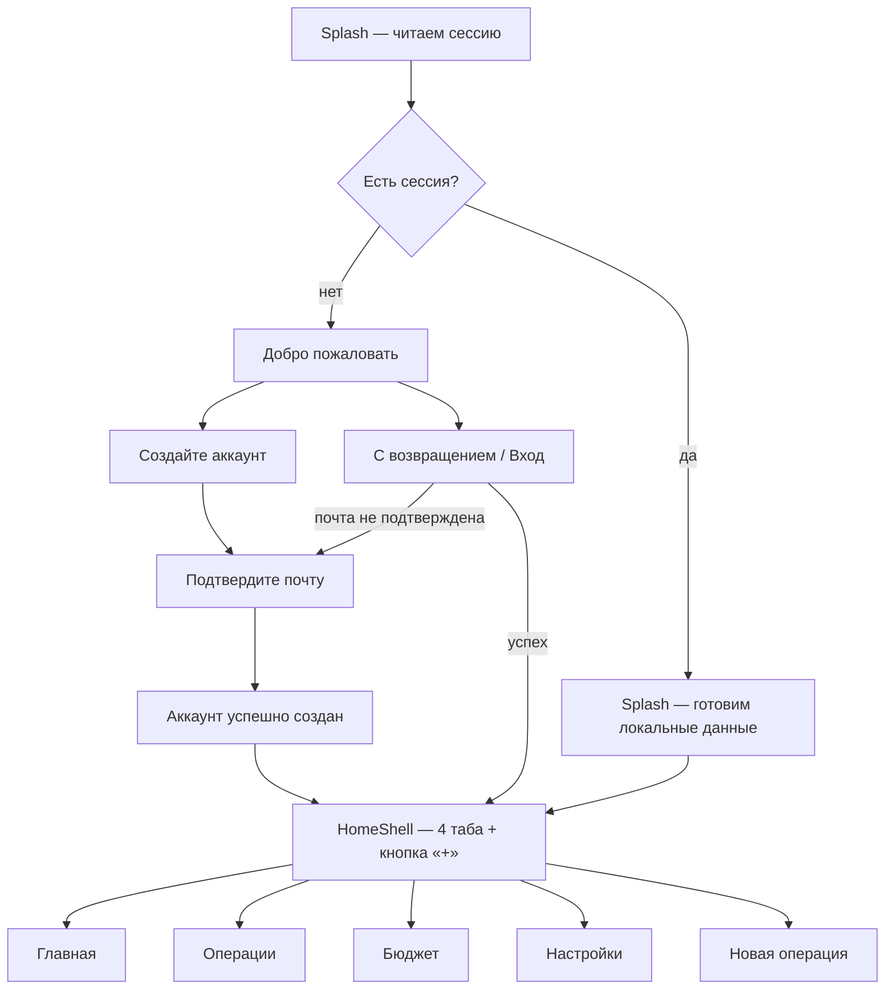
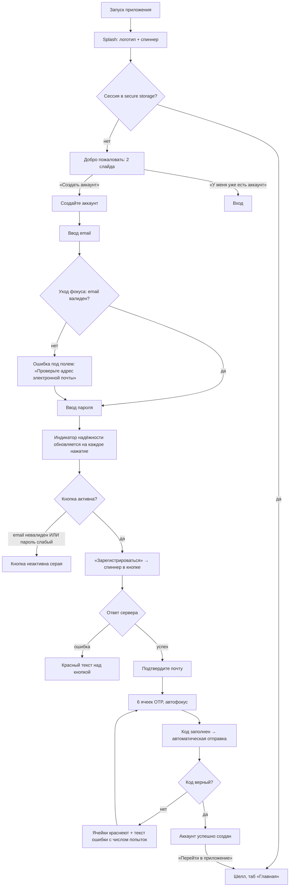
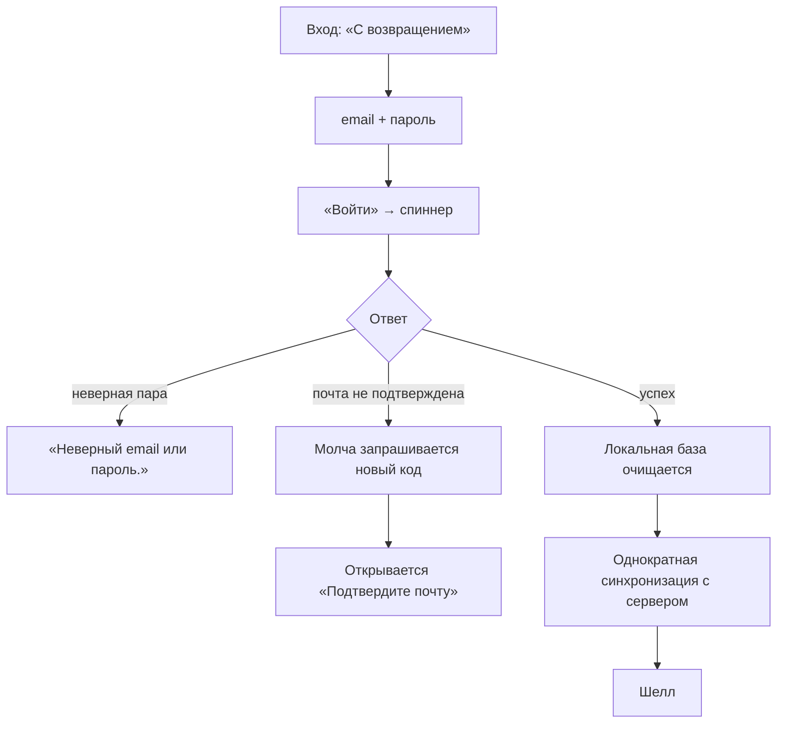
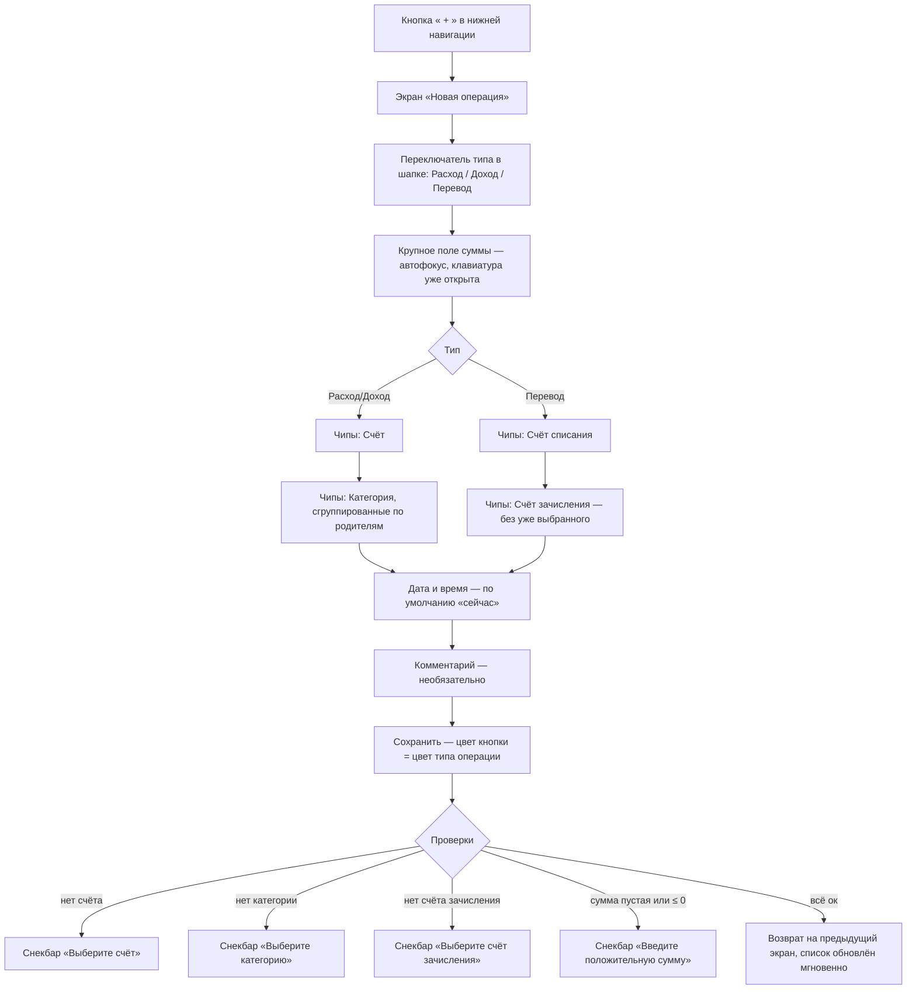
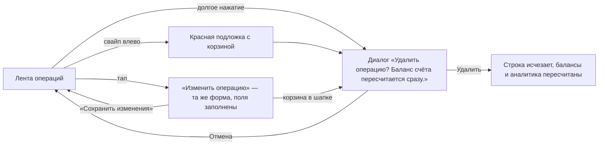
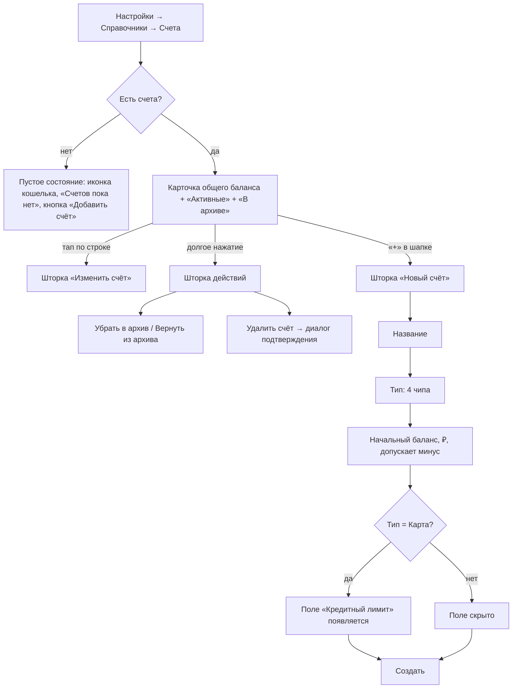
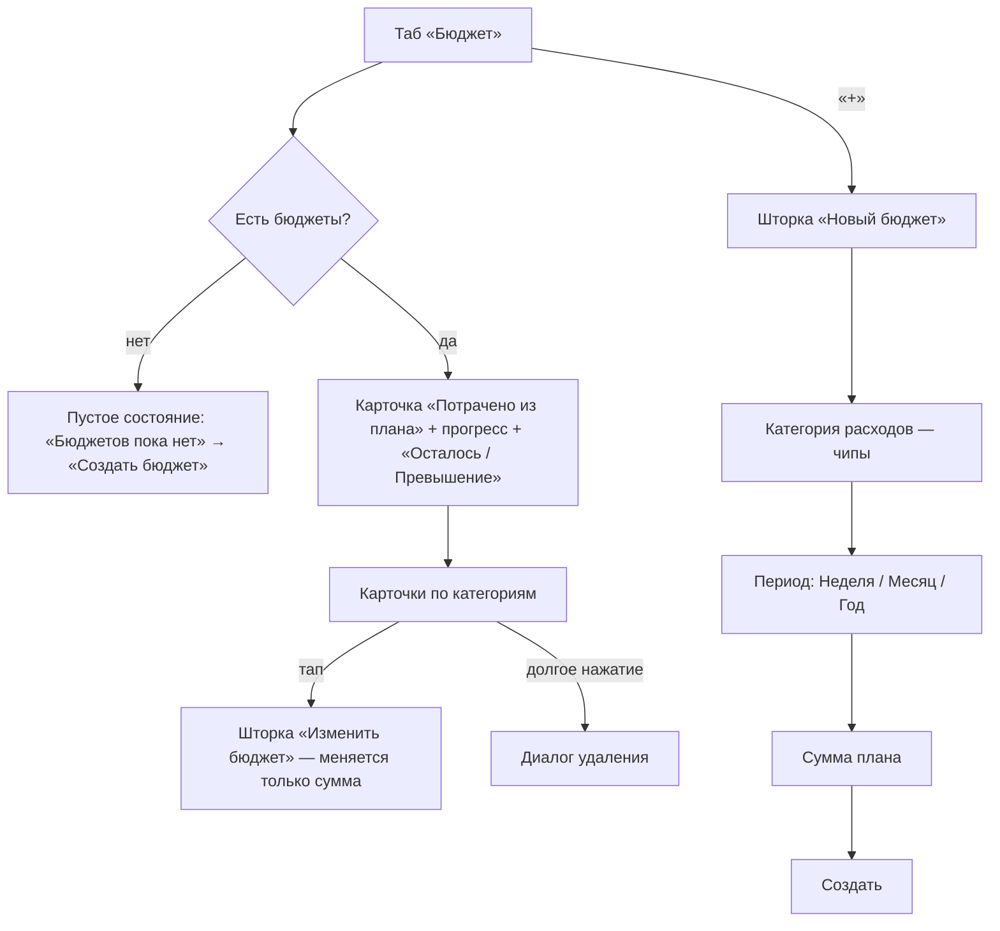
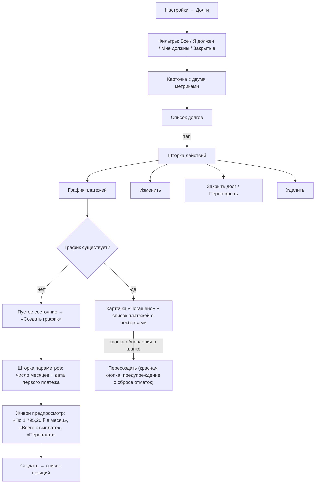
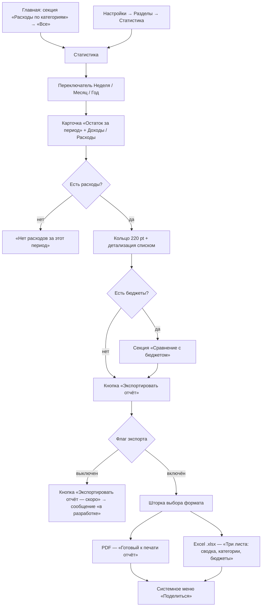
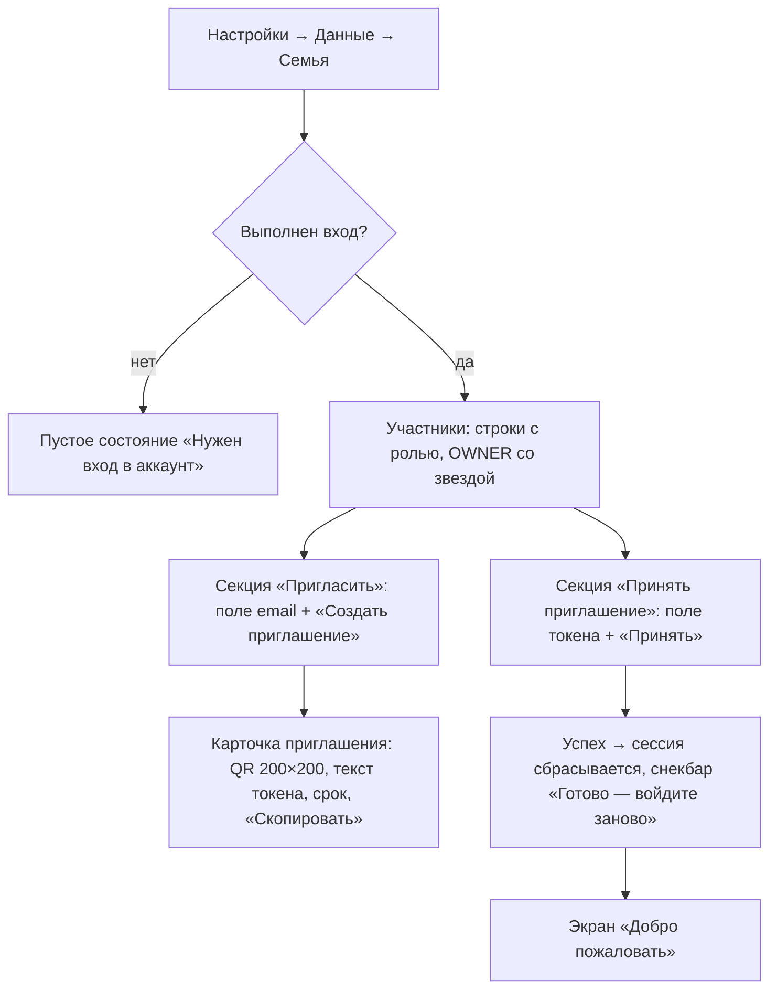

# MyMoney — дизайн-бриф: полный стек функций и user-flow

> **Кому:** дизайнеру интерфейса.
> **Что это:** исчерпывающее описание того, что приложение **уже умеет** (по состоянию кода на ветке `Alpha`), какие экраны и состояния существуют, как пользователь по ним ходит, какие правила и тексты зашиты в логику, и **что осталось спроектировать**.
> **Как читать:** разделы 1–3 — контекст и карта. Раздел 4 — стек функций таблицей. Раздел 5 — user-flow. Раздел 6 — поэкранные спецификации со всеми состояниями. Разделы 7–10 — правила, тексты, дизайн-система. Раздел 11 — список дыр, которые нужно закрыть дизайном.
> Всё, что описано в разделах 4–9, **уже реализовано в коде** — это не пожелания, а фактическое поведение. Гипотезы и предложения вынесены отдельно в раздел 11.

---

## Оглавление

1. [Продукт за 2 минуты](#1-продукт-за-2-минуты)
2. [Жёсткие продуктовые правила](#2-жёсткие-продуктовые-правила)
3. [Карта приложения и навигация](#3-карта-приложения-и-навигация)
4. [Полный стек функций](#4-полный-стек-функций)
5. [User-flow](#5-user-flow)
6. [Поэкранные спецификации](#6-поэкранные-спецификации)
7. [Данные: что можно показать на экране](#7-данные-что-можно-показать-на-экране)
8. [Правила отображения и форматирование](#8-правила-отображения-и-форматирование)
9. [Валидация, ошибки и тексты](#9-валидация-ошибки-и-тексты)
10. [Дизайн-система: то, что уже есть в коде](#10-дизайн-система-то-что-уже-есть-в-коде)
11. [Что нужно спроектировать (дыры и задачи)](#11-что-нужно-спроектировать-дыры-и-задачи)
12. [Приложение: матрицы и глоссарий](#12-приложение-матрицы-и-глоссарий)

---

## 1. Продукт за 2 минуты

**MyMoney** — мобильное приложение (Flutter, iOS + Android) для учёта личных и семейных финансов.

| | |
|---|---|
| **Ядро ценности** | Записать трату за считанные секунды и увидеть, куда уходят деньги |
| **Основной сценарий** | Добавление операции. Всё остальное — обвязка вокруг него |
| **Модель работы** | **Offline-first.** Локальная база на устройстве — источник истины. Сервер нужен только для аккаунта и (в будущем) для обмена данными между участниками семьи |
| **Валюта** | Только рубль. Мультивалютности нет и не планируется в MVP |
| **Язык** | Только русский. Локаль `ru_RU` зашита |
| **Тема** | Только светлая. Тёмной темы нет |
| **Аккаунт** | Обязателен. Без входа пользователь видит только онбординг |
| **Единица владения данными** | «Семья» (`family`). Все счета, категории и операции принадлежат семье, а не пользователю. Даже у одиночного пользователя есть семья из одного человека |

### Кто пользователь

Человек, который ведёт бюджет и хочет:
- фиксировать доходы/расходы/переводы между своими счетами;
- планировать лимиты по категориям (бюджеты);
- копить на цели;
- помнить о долгах и подписках;
- смотреть аналитику за неделю/месяц/год.

---

## 2. Жёсткие продуктовые правила

Эти правила зашиты в логику. Дизайн не может им противоречить.

| # | Правило | Что это значит для интерфейса |
|---|---|---|
| 1 | **Деньги — целые копейки** | Никаких «≈», округлений в большую сторону, дробных процентов от суммы. Всегда две цифры после запятой: `1 234,56 ₽` |
| 2 | **Только рубль** | Нигде нет селектора валюты. Символ всегда `₽` |
| 3 | **Мягкое удаление** | Удалённая сущность исчезает из списков, но её история сохраняется. Тексты подтверждений это отражают: «Операции по нему сохранятся» |
| 4 | **Архив ≠ удаление** | У счетов и категорий есть отдельное состояние «в архиве»: не предлагается при вводе, но видно в справочнике и участвует в истории |
| 5 | **Переводы не влияют на доход/расход** | Перевод между своими счетами не попадает в аналитику, в итоги дня и в бюджеты. Он только перекладывает деньги |
| 6 | **Категории — максимум 2 уровня** | Родитель и подкатегория. Третьего уровня нет — ни в форме, ни в списке |
| 7 | **Дата операции — не в будущем** | Календарь при вводе операции ограничен сегодняшним днём сверху |
| 8 | **Всё работает офлайн** | Нет состояния «загрузка данных с сервера» на основных экранах. Данные читаются локально и мгновенно |
| 9 | **Аутентификация обязательна** | Гостевого режима нет. Первый экран для неавторизованного — «Добро пожаловать» |

---

## 3. Карта приложения и навигация

### 3.1. Верхнеуровневая структура



### 3.2. Нижняя навигация

Кастомная, не стандартный Material `NavigationBar`:

```
┌───────────────────────────────────────────────────────┐
│  ╭─────────────────────────────────────╮   ╭───────╮  │
│  │ [Главная] Операции  Бюджет  Настройки│   │   +   │  │
│  ╰─────────────────────────────────────╯   ╰───────╯  │
└───────────────────────────────────────────────────────┘
   «Таблетка» 62 pt высотой, радиус 1000    Круг 62×62
   Активный таб — синяя пилюля #0088FF,     Отдельно от
   белая иконка + белая подпись 10 pt       таблетки, 16 pt зазор
```

- Табы держатся в `IndexedStack` — **состояние вкладки не сбрасывается** при переключении (скролл, выбранный фильтр сохраняются).
- Кнопка «+» — не таб. Она открывает «Новую операцию» поверх всего (полноэкранный `push`).
- Отступ контента снизу под навигацией — **130 pt** (`kMmTabBottomInset`).

### 3.3. Что за «Настройками»

«Настройки» — не «системные параметры», а **хаб-меню всего остального**. Из четырёх табов достижимо только четыре экрана; остальные 10+ экранов открываются отсюда.

```
Настройки (таб)
├── [Поиск по настройкам]         ← фильтрует пункты по названию и подписи
├── Карточка профиля              → Профиль
│
├── Разделы
│   ├── Статистика                → Статистика (аналитика)
│   ├── Цели                      → Цели
│   ├── Долги                     → Долги → График платежей
│   └── Подписки                  → Подписки
├── Справочники
│   ├── Счета                     → Счета
│   └── Категории                 → Категории
├── Данные
│   ├── Экспорт отчёта   [Скоро]  → Статистика (или «в разработке»)
│   ├── Синхронизация    [Скоро]  → Синхронизация (или «в разработке»)
│   ├── Семья            [Скоро]  → Семья (или «в разработке»)
│   └── Подключение к серверу     → Подключение
├── Оформление
│   └── Тема               Светлая  → «в разработке»
├── О приложении
│   ├── Версия приложения   1.0.0   (без перехода)
│   ├── Условия использования       → снекбар «пока не опубликованы»
│   └── Политика конфиденциальности → снекбар «пока не опубликована»
└── [ Выйти ]                       красным
```

> **Важно для дизайна:** пункты за фичефлагами (`Экспорт`, `Синхронизация`, `Семья`) **не скрыты**. Они показываются с текстовой меткой «Скоро» справа и по тапу показывают всплывающее сообщение «в разработке». Это осознанное решение: пользователь должен видеть, что функция существует.

---

## 4. Полный стек функций

Легенда статуса:
- ✅ **Готово** — работает и доступно пользователю.
- 🚩 **За флагом** — код есть и работает, точка входа закрыта фичефлагом, пункт виден с меткой «Скоро».
- 🔸 **Заглушка** — элемент интерфейса есть, по тапу показывает «пока не реализовано».
- ❌ **Нет** — не существует.

### 4.1. Аутентификация и аккаунт

| Функция | Статус | Детали |
|---|---|---|
| Приветственная карусель (2 слайда) | ✅ | Точки-индикаторы, свайп |
| Регистрация по email + паролю | ✅ | Двухшаговая: регистрация → подтверждение кода |
| Индикатор надёжности пароля | ✅ | 3 сегмента: слабый (красный) / средний (жёлтый) / надёжный (зелёный) |
| Показать/скрыть пароль | ✅ | Иконка-глаз в поле |
| Подтверждение почты 6-значным кодом | ✅ | OTP-поле из 6 ячеек, автосабмит при заполнении |
| Повторная отправка кода с обратным отсчётом | ✅ | Кулдаун приходит **с сервера** (60 с), не зашит в клиент |
| Экран «Аккаунт успешно создан» | ✅ | Нельзя вернуться назад (`canPop: false`) |
| Вход существующего пользователя | ✅ | |
| Автоперевод на подтверждение при входе с неподтверждённой почтой | ✅ | Не показывает ошибку — молча отправляет новый код и открывает OTP-экран |
| Автовход при перезапуске (сессия в secure storage) | ✅ | Splash → сразу шелл |
| Выход из аккаунта | ✅ | Кнопка «Выйти» внизу настроек |
| Автообновление токена при истечении | ✅ | Незаметно для пользователя |
| Восстановление пароля | ❌ | **Нет ни на клиенте, ни на сервере** |
| Вход по соцсетям / Apple ID / Google | ❌ | |
| Смена пароля | 🔸 | Строка в профиле → «пока не реализована» |
| Смена почты | 🔸 | Показана прочерком `—` |
| Вход по биометрии | 🔸 | Переключатель есть, показывает «пока не реализована» |
| Активные устройства | 🔸 | Строка со значением `1` → «пока не реализован» |
| Удаление аккаунта | 🔸 | Кнопка с подтверждением → «пока не реализовано» |
| Аватар / фото профиля | 🔸 | «Изменить фото» → «пока не реализовано» |

### 4.2. Операции (транзакции) — ядро

| Функция | Статус | Детали |
|---|---|---|
| Добавление расхода | ✅ | Тип по умолчанию |
| Добавление дохода | ✅ | |
| Перевод между счетами | ✅ | Вместо категории — второй счёт; перевод на себя запрещён |
| Все шаги на одном экране | ✅ | Сумма → счёт → категория, без визарда |
| Автовыбор единственного счёта | ✅ | Если счёт один — выбирать нечего, он подставляется |
| Дата и время операции | ✅ | По умолчанию «сейчас», выбор ограничен сегодняшним днём |
| Комментарий | ✅ | Необязательный |
| Редактирование операции | ✅ | Тап по строке в ленте |
| Удаление операции | ✅ | Три способа: свайп влево в ленте, долгое нажатие, кнопка-корзина в режиме редактирования |
| Лента операций с фильтром по типу | ✅ | Все / Доходы / Расходы / Переводы |
| Группировка ленты по дням + итог дня | ✅ | «Сегодня», «Вчера», далее — дата |
| Сводка доходов/расходов над лентой | ✅ | По текущему фильтру |
| Последние 11 операций на Главной | ✅ | |
| Фото чека / вложение | ❌ | Поле в модели есть (`attachmentPhotoPath`), интерфейса нет |
| Поиск по операциям | ❌ | |
| Фильтр по счёту / категории / диапазону дат | ❌ | Только по типу |
| Отдельный экран деталей операции | ❌ | Тап сразу открывает форму редактирования |
| Повторяющиеся операции | ❌ | |

### 4.3. Счета

| Функция | Статус | Детали |
|---|---|---|
| Список счетов с балансами | ✅ | Разделы «Активные» и «В архиве» |
| Общий баланс по всем активным счетам | ✅ | Карточкой сверху |
| Создание счёта | ✅ | Название, тип, начальный баланс, кредитный лимит |
| 4 типа счёта | ✅ | Наличные, Карта, Накопления, Другое |
| Кредитный лимит | ✅ | **Поле показывается только для типа «Карта».** Пусто = дебетовая |
| «Доступно к трате» для кредитки | ✅ | `лимит + баланс` в подписи строки |
| Отрицательный начальный баланс | ✅ | Для долга по кредитке; подсказка в форме |
| Редактирование счёта | ✅ | Тап по строке |
| Архивация / возврат из архива | ✅ | Долгое нажатие → меню действий; плюс переключатель в форме |
| Удаление счёта | ✅ | Долгое нажатие → меню; мягкое удаление |
| Горизонтальные карточки счетов на Главной | ✅ | 161×94 pt, иконка + название + баланс |
| Перевыпуск / номер карты / банк | ❌ | Счёт — просто название и тип |
| Иконка/цвет счёта на выбор | ❌ | Иконка выводится автоматически по типу |

### 4.4. Категории

| Функция | Статус | Детали |
|---|---|---|
| Разделение на расходные и доходные | ✅ | Переключатель вверху |
| Двухуровневое дерево | ✅ | Родитель + подкатегории с отступом |
| 15 системных категорий при первом запуске | ✅ | 4 доходных + 11 расходных, 5 из них помечены «обязательная» |
| Создание категории | ✅ | Название, родитель, иконка |
| Выбор иконки из палитры 16 иконок | ✅ | Сетка 44×44 pt, выбранная — синяя |
| Флаг «Обязательная» | ✅ | Только для расходов. Бейдж «обязательная» в списке |
| Архивация категории | ✅ | Переключатель в форме; отдельная секция «В архиве» с прозрачностью 55 % |
| Удаление категории | ✅ | Долгое нажатие. **Системные удалить нельзя** — снекбар |
| Умное удаление родителя | ✅ | Подкатегории не удаляются, а поднимаются на верхний уровень. Пользователь предупреждён в диалоге |
| Цвет категории | ⚠️ | Поле в модели есть и используется при отрисовке, но **выбора цвета в форме нет** — цвет назначается по умолчанию (зелёный для доходов, оранжевый для расходов) |
| Порядок / сортировка категорий вручную | ❌ | |

### 4.5. Бюджеты

| Функция | Статус | Детали |
|---|---|---|
| Бюджет на категорию расходов за период | ✅ | Один бюджет = одна категория + один период |
| Три периода | ✅ | Неделя, Месяц, Год |
| Общая карточка «Потрачено из плана» | ✅ | Сумма планов и трат по всем бюджетам, прогресс-бар |
| Карточки по категориям с прогрессом | ✅ | Иконка категории, ярлык периода, `X из Y`, остаток |
| Индикация превышения | ✅ | Прогресс краснеет, вместо «Осталось» — «Превышение», сумма с `+` |
| Редактирование суммы плана | ✅ | Тап по карточке |
| Удаление бюджета | ✅ | Долгое нажатие |
| Категория и период у созданного бюджета неизменяемы | ✅ | В форме показывается только выбранное значение + пояснение в подзаголовке |
| Уведомление о приближении к лимиту | ❌ | Push-уведомлений в приложении нет вовсе |
| Бюджет на все расходы (без категории) | ❌ | Только по категориям |
| Перенос остатка на следующий период | ❌ | |

### 4.6. Цели

| Функция | Статус | Детали |
|---|---|---|
| Список целей с прогрессом | ✅ | |
| Общая карточка «Накоплено по целям» | ✅ | Сумма всех целей и общий прогресс |
| Создание цели | ✅ | Название, целевая сумма, срок (необязательный) |
| Пополнение цели | ✅ | Кнопка «Пополнить» на карточке → шторка ввода суммы |
| Снятие с цели | ✅ | Кнопка «Снять». Нельзя снять больше, чем накоплено |
| Отметка достигнутой цели | ✅ | Вместо процента — зелёная галочка |
| Редактирование / удаление | ✅ | Тап / долгое нажатие |
| История пополнений | ❌ | Явно сказано в диалоге удаления: «История пополнений не хранится отдельно» |
| Связь пополнения цели с операцией по счёту | ❌ | Пополнение цели **не списывает деньги со счёта** |

### 4.7. Долги

| Функция | Статус | Детали |
|---|---|---|
| Два направления | ✅ | «Я должен» / «Мне должны» |
| Сводка в обе стороны | ✅ | Две метрики в одной карточке |
| Фильтры | ✅ | Все / Я должен / Мне должны / Закрытые |
| Создание долга | ✅ | Контрагент, сумма, ставка % годовых, срок |
| Процентная ставка | ✅ | 0–1000 %, пусто = беспроцентный |
| Пометка просроченного | ✅ | Слово «просрочен» в подписи |
| Закрытие / переоткрытие долга | ✅ | Закрытый — 55 % прозрачности + зачёркнутое название |
| Редактирование / удаление | ✅ | Через меню действий по тапу |
| **График платежей** | ✅ | Отдельный экран |
| Генерация графика | ✅ | Ввод числа месяцев + дата первого платежа |
| Аннуитет при ненулевой ставке | ✅ | Равные платежи с процентами, показывается переплата |
| Равные доли при нулевой ставке | ✅ | Остаток от деления добирает последний платёж |
| Предпросмотр графика до создания | ✅ | «По X ₽ в месяц», «Всего к выплате», «Переплата» |
| Отметка платежа оплаченным | ✅ | Круглый чекбокс слева, зачёркивание |
| Прогресс погашения | ✅ | «Погашено X из Y • платежей 3 из 6» |
| Пересоздание графика | ✅ | Кнопка обновления в шапке, предупреждение о сбросе отметок |
| Связь платежа по графику с операцией | ❌ | Отметка «оплачено» **не создаёт операцию и не меняет баланс счёта** |
| Частичное погашение произвольной суммой | ❌ | |

### 4.8. Подписки

| Функция | Статус | Детали |
|---|---|---|
| Список по дате ближайшего списания | ✅ | Сортировка по возрастанию даты |
| Карточка «В среднем в месяц» | ✅ | Недельные ×52/12, годовые ÷12 |
| Три периодичности | ✅ | Раз в неделю / месяц / год |
| Обратный отсчёт до списания | ✅ | «сегодня», «через 3 дня», «просрочено» — с правильным склонением |
| Отметка «Оплачено» | ✅ | Сдвигает дату на следующий период (с защитой от 31-го числа) |
| Редактирование / удаление | ✅ | Через меню действий |
| Категория подписки | ⚠️ | Поле в модели есть, **в форме не спрашивается** |
| Автосоздание операции при списании | ❌ | Отметка «Оплачено» не трогает баланс |
| Напоминание перед списанием | ❌ | Уведомлений нет |

### 4.9. Аналитика и отчёты

| Функция | Статус | Детали |
|---|---|---|
| Переключатель периода | ✅ | Неделя / Месяц / Год. **Общий с Главной** — переключение на одном экране меняет и другой |
| Карточка «Остаток за период» | ✅ | Доходы − расходы, красный если минус; плюс две метрики |
| Кольцевая диаграмма расходов | ✅ | Топ-6 категорий; остальные — серым сектором |
| Легенда с процентами (на Главной) | ✅ | До 6 строк: точка, название, `%` |
| Детализация по категориям | ✅ | Список: точка цвета, название, сумма, `%` |
| Сравнение с бюджетом | ✅ | Карточки «В норме» / «Превышено» с прогрессом |
| Единый цвет категории на всех экранах | ✅ | Порядок цветов один: индиго → коричневый → жёлтый → циан → розовый → синий |
| Экспорт в PDF | 🚩 | Реализован, закрыт флагом |
| Экспорт в Excel (3 листа) | 🚩 | Реализован, закрыт флагом |
| Выбор формата перед выгрузкой | 🚩 | Шторка с двумя строками: PDF / Excel |
| Графики динамики (линейные, по месяцам) | ❌ | Только круговая диаграмма |
| Аналитика по доходам | ❌ | Разбивка по категориям — только для расходов |
| Произвольный диапазон дат | ❌ | Только три фиксированных периода |
| Сравнение с прошлым периодом | ❌ | |

### 4.10. Синхронизация и семья

| Функция | Статус | Детали |
|---|---|---|
| Экран состояния синхронизации | 🚩 | Статус-точка: простой / идёт / нет сети / ошибка |
| Ручной запуск синхронизации | 🚩 | Кнопка «Синхронизировать сейчас» |
| Счётчики последнего цикла | 🚩 | Отправлено / Получено / Конфликтов |
| Автоматическая фоновая синхронизация | ⚠️ | Планировщик написан, но **не запускается**. Фактически обмен происходит только в момент входа |
| Настройка адреса сервера | ✅ | Отдельный экран, поле + сброс к дефолту |
| Список участников семьи | 🚩 | Роль OWNER помечена звездой |
| Приглашение по email | 🚩 | Генерирует одноразовый токен |
| QR-код приглашения | 🚩 | 200×200 + текст токена + срок действия + «Скопировать» |
| Принятие приглашения по токену | 🚩 | После принятия требуется повторный вход |
| Разграничение прав внутри семьи | ❌ | Роль отображается, но ничего не ограничивает |

### 4.11. Чего нет вовсе

- Push-уведомления и напоминания любого вида
- Тёмная тема
- Виджеты на домашний экран
- Импорт выписки из банка / подключение к банку
- Распознавание чеков
- Резервная копия и восстановление файлом
- Мультивалютность и курсы
- Онбординг-подсказки внутри приложения (coach marks)
- Поиск по чему-либо, кроме настроек
- Планшетная / ландшафтная адаптация (макеты только под телефон-портрет)

---

## 5. User-flow

### 5.1. F1 — Первый запуск и регистрация



**Ключевые тонкости для дизайна:**

1. **Splash не по таймеру.** Он висит ровно столько, сколько реально читается сессия и готовятся локальные данные. Анимация должна выдерживать и 200 мс, и 3 с.
2. **Регистрация не выдаёт доступа.** После шага «Зарегистрироваться» пользователь ещё не вошёл. Кнопка «назад» с OTP-экрана возвращает на форму регистрации — это допустимо.
3. **Экран «Аккаунт создан» — точка невозврата.** Системная кнопка «назад» отключена.
4. **Обратный отсчёт на переотправку задаёт сервер.** Стандартно 60 секунд, но при попытке отправить слишком рано сервер вернёт свой остаток — интерфейс обязан показать именно его.
5. Ошибка **не блокирует** экран — она появляется текстом и исчезает при первом изменении поля.

### 5.2. F2 — Вход



> **Неочевидное:** при входе локальная база **полностью очищается** и заполняется данными вошедшего пользователя. Если на устройстве были данные другого аккаунта — они исчезнут. Сейчас пользователь об этом не предупреждается (см. раздел 11).

### 5.3. F3 — Повторная отправка кода

```
Состояние 1 (сразу после открытия экрана):
   «Повторная отправка через 58 с»   — серым, без кнопки

Состояние 2 (отсчёт дошёл до нуля):
   [ Отправить код повторно ]        — кликабельно, чёрный жирный

Состояние 3 (запрос в полёте):
   ( ◌ )                             — спиннер по центру

Состояние 4 (успех):
   зелёный текст: «Новый код отправлен на user@mail.ru»
   → отсчёт стартует заново

Состояние 5 (сервер отказал, кулдаун не истёк):
   красный текст: «Код уже отправлен. Повторить можно через 34 с.»
   → отсчёт перезапускается на 34 с
```

### 5.4. F4 — Добавление операции (главный сценарий)

Целевое время — **менее 10 секунд**. Все шаги на одном экране, без визарда.



**Дизайн-критичные детали:**

| Деталь | Поведение |
|---|---|
| Цвет-код типа | Расход — красный `#FF383C`, Доход — зелёный `#34C759`, Перевод — синий `#0088FF`. Цвет применяется к цифрам суммы **и** к кнопке «Сохранить» |
| Смена типа | Сбрасывает выбранную категорию и счёт-получатель. Сумма и счёт списания сохраняются |
| Единственный счёт | Подставляется автоматически, пользователь его не выбирает |
| Категории двумя уровнями | Категории **без детей** идут одним общим рядом чипов сверху; категории **с детьми** — подзаголовком, под ним чипы: сам родитель + его подкатегории |
| Осиротевшие подкатегории | Если родителя удалили — его дети поднимаются в общий ряд, а не исчезают |
| Нет счетов | Вместо чипов — подсказка «Счетов нет — добавьте счёт в Настройках» |
| Нет категорий | Красный текст «Нет категорий — добавьте их в Настройках» |
| Дата | Сначала календарь, потом выбор времени. Отмена времени — оставляет старое время |
| Ошибки | Только снекбаром снизу. Поля не подсвечиваются красным |

### 5.5. F5 — Редактирование и удаление операции



> **Тонкость свайпа:** строка **не уезжает сразу**. Она возвращается на место, диалог накрывает экран, и строка исчезает только после подтверждения. Это сделано намеренно — свайп не должен быть более разрушительным способом удаления, чем обычный.

### 5.6. F6 — Работа со счетами



Внизу списка — постоянная пояснительная строка мелким шрифтом:
> «Долгое нажатие на счёт — архив и удаление. Архивный счёт не предлагается в новых операциях, но его история сохраняется.»

### 5.7. F7 — Категории

```mermaid
flowchart TD
    A[Настройки → Категории] --> B[Переключатель: Расходы / Доходы]
    B --> C[Дерево: карточка на каждого родителя, дети с отступом]
    C --> D[Секция «В архиве» — 55% прозрачности]
    C -- тап --> E[Шторка редактирования]
    C -- долгое нажатие --> F{Системная?}
    F -- да --> G[Снекбар «Системные категории удалить нельзя»]
    F -- нет --> H{Есть подкатегории?}
    H -- да --> I["Диалог: «...Подкатегорий: 3. Они станут самостоятельными, а не удалятся вместе с родителем.»"]
    H -- нет --> J[Обычный диалог удаления]
    A -- «+» --> K[Шторка «Новая категория (расход)»]
    K --> K1[Название]
    K1 --> K2[Родительская категория — чипы «Без родителя» + корневые]
    K2 --> K3{Тип расход?}
    K3 -- да --> K4[Переключатель «Обязательная»]
    K3 -- нет --> K5
    K4 --> K5[Сетка из 16 иконок]
    K5 --> L[Создать]
```

**Правила выбора родителя (важно для UI-текстов):**
- В родители предлагаются только **корневые категории того же типа**, не в архиве, не она сама.
- Если у редактируемой категории **уже есть дети** — блок выбора родителя вообще не показывается (иначе получился бы третий уровень).

### 5.8. F8 — Бюджеты



**Начало периода считается от типа:** недельный бюджет стартует с понедельника текущей недели, месячный — с 1-го числа, годовой — с 1 января. Это не выбирается пользователем.

### 5.9. F9 — Цели

```
Экран «Цели»
├── Карточка «Накоплено по целям»  ← сумма всех + общий прогресс + «Цель: X ₽»
└── Карточки целей
    ┌────────────────────────────────────┐
    │ Отпуск                      64%    │  ← или ✅ если достигнута
    │ До 1 августа 2026                  │  ← только если задан срок
    │ ▓▓▓▓▓▓▓▓▓▓▓░░░░░░░                │
    │ 64 000,00 ₽ из 100 000,00 ₽        │
    │ [  − Снять  ] [  + Пополнить  ]    │  ← вторичная / первичная зелёная
    └────────────────────────────────────┘
```

Пополнение/снятие открывают одинаковую шторку с одним полем суммы; отличаются заголовком, подзаголовком (название цели), надписью и цветом кнопки. Попытка снять больше накопленного → снекбар «Невозможно снять больше, чем накоплено».

### 5.10. F10 — Долги и график платежей



**Что показывает предпросмотр** (это главная ценность экрана — видно, во что превратится ставка, ещё до создания):
- при ставке **0 %** — тело долга делится поровну, остаток копеек добирает последний платёж;
- при ставке **> 0 %** — аннуитет, показывается сумма переплаты.

**Важное ограничение, которое нужно учесть в текстах:** отметка «оплачено» — это **план**, а не факт. Она не создаёт операцию и не меняет баланс счёта.

### 5.11. F11 — Подписки

```
┌──────────────────────────────────────┐
│ В среднем в месяц                    │
│ 2 340,00 ₽                           │
│ Подписок: 5. Недельные и годовые     │
│ пересчитаны к месяцу.                │
└──────────────────────────────────────┘

Ближайшие списания
  ⟳  Музыка                    299,00 ₽
     Раз в месяц • 3 сент 2026  через 4 дня
  ⟳  Облако                     990,00 ₽   ← красным, если
     Раз в год • 28 авг 2026    просрочено      просрочено
```

Тап по строке → шторка: **Оплачено** (сдвинуть дату на следующий период) / Изменить / Удалить.

### 5.12. F12 — Аналитика и экспорт



### 5.13. F13 — Настройки, поиск и выход

- Поле поиска в шапке фильтрует **все пункты всех групп** по названию и подписи.
- Когда в поиске что-то введено — **карточка профиля и кнопка «Выйти» скрываются**, остаётся только результат.
- Пустой результат: «Ничего не найдено» по центру.
- «Выйти» → сессия стирается → приложение мгновенно возвращается на «Добро пожаловать». **Диалога подтверждения нет.**

### 5.14. F14 — Подключение к серверу

Нужен на реальном устройстве, чтобы указать адрес компьютера с бэкендом.

```
┌──────────────────────────────────────┐
│ Текущий адрес                        │
│ http://10.0.2.2:8080                 │
│ Значение по умолчанию для платформы  │  ← или «Задан вручную на этом устройстве»
└──────────────────────────────────────┘

Новый адрес
[ http://192.168.1.50:8080          ]
С реальным телефоном нужен LAN-адрес компьютера.
Эмулятор Android: http://10.0.2.2:8080,
симулятор iOS и десктоп: http://localhost:8080.

[         Сохранить          ]
[ ↺ Вернуть значение по умолчанию ]   ← неактивна, если адрес и так дефолтный
```

Валидация: адрес обязан начинаться с `http://` или `https://` и иметь хост, иначе — снекбар.

### 5.15. F15 — Семья (за флагом)



> **Дизайн-проблема, требующая решения:** принятие приглашения выкидывает пользователя из аккаунта. Сейчас это объясняется одной строкой подсказки под полем. Нужен нормальный экран-предупреждение (см. раздел 11).

---

## 6. Поэкранные спецификации

Формат: **Назначение → Откуда попадают → Шапка → Содержимое → Состояния → Действия.**

### 6.1. Splash

| | |
|---|---|
| **Назначение** | Показывается, пока читается сохранённая сессия и готовятся локальные данные |
| **Содержимое** | Логотип (BrandMark) по центру + спиннер 22×22, толщина 2.4 |
| **Фон** | `#F4EDE3` |
| **Состояния** | Одно. Экран никуда сам не переходит — решение принимает логика уровнем выше |

### 6.2. Добро пожаловать

| | |
|---|---|
| **Содержимое** | BrandMark сверху → карусель из 2 слайдов → точки-индикаторы → кнопка → текстовая ссылка |
| **Слайд 1** | «Все финансы\nв одном месте» / «Считайте доходы, расходы и накопления без таблиц и лишних приложений.» |
| **Слайд 2** | «Понятная\nаналитика» / «Графики и отчёты покажут, куда уходят деньги каждый месяц.» |
| **Индикатор** | Активная точка — 20×6 pt, `#892029`; неактивная — 6×6, `#E3DACB`. Анимация 200 мс |
| **Кнопки** | Первичная чёрная «Создать аккаунт»; ниже текстовая «У меня уже есть аккаунт» |
| **Текст слайдов** | Выровнен по левому краю, вертикально — по центру области |

### 6.3. Создайте аккаунт

**Блоки:** ← назад · Заголовок «Создайте аккаунт» · Подзаголовок · Поле email · Поле пароля с глазом · Индикатор надёжности · [Ошибка] · Кнопка.

**Состояния полей и кнопки:**

| Состояние | Что видно |
|---|---|
| Пустая форма | Оба поля пустые, кнопка **неактивна** (`#BEB6A9`), под паролем подпись «Минимум 8 символов, буквы и цифры» серым |
| Фокус в поле | Рамка `#000000`, толщина 1.5 |
| Ошибка email (на уходе фокуса) | Рамка `#B3261E` + текст «Проверьте адрес электронной почты» |
| Пароль < 8 символов | 1 из 3 сегментов красный, текст «Слабый пароль — добавьте цифры или заглавные буквы». Кнопка остаётся неактивной |
| Пароль средний | 2 сегмента жёлтые `#C98A1F`, «Средняя надёжность». Кнопка активна |
| Пароль надёжный | 3 сегмента зелёные `#2E7D46`, «Надёжный пароль» |
| Отправка | В кнопке спиннер, **оба поля заблокированы** |
| Ошибка сервера | Красный текст между индикатором и кнопкой |

**Правило активности кнопки:** email синтаксически верен **И** пароль не «слабый» **И** не идёт отправка.

**Оценка надёжности** (для точности макета): базовое требование — 8 символов. Далее по 1 баллу за: длину ≥ 12, заглавную букву, цифру, спецсимвол. 0–1 балл → слабый, 2 → средний, 3–4 → надёжный.

### 6.4. Подтвердите почту

**Блоки:** ← назад · «Подтвердите почту» · «Мы прислали 6-значный код на **user@mail.ru**» (адрес — жирным чёрным внутри серого текста) · OTP-поле · зона статуса · распорка · зона переотправки внизу.

| Состояние | Что видно |
|---|---|
| Ожидание ввода | 6 пустых ячеек, фокус в первой |
| Проверка | Спиннер 20×20 под полем, поле заблокировано |
| Неверный код | Ячейки в состоянии ошибки + красный текст «Неверный код. Осталось попыток: 3.» |
| Код истёк | «Срок действия кода истёк. Запросите новый.» |
| Попытки кончились | «Слишком много попыток. Запросите новый код.» |
| Код переотправлен | Зелёный текст «Новый код отправлен на user@mail.ru» |
| Отсчёт идёт | Внизу серым «Повторная отправка через 45 с» |
| Отсчёт кончился | Внизу кнопка-ссылка «Отправить код повторно» |
| Переотправка в полёте | Спиннер вместо кнопки |

> Код проверяется **автоматически** при заполнении шестой ячейки. Отдельной кнопки «Подтвердить» нет.

### 6.5. Аккаунт успешно создан

Чёрный круг 96×96 с белой галочкой → заголовок «Аккаунт успешно создан» (по центру) → «Теперь вы можете добавить свои счета и начать отслеживать бюджет.» → кнопка «Перейти в приложение» внизу. Возврат назад заблокирован.

### 6.6. Вход

Идентичен по вёрстке экрану регистрации. Заголовок «С возвращением», подзаголовок «Войдите, чтобы синхронизировать данные на всех устройствах.» Нет индикатора надёжности. Кнопка активна, если email валиден и пароль непустой. **Ссылки «Забыли пароль?» нет.**

### 6.7. Главная (таб 1)

```
Главная                                    ← крупный заголовок

┌────────────────────────────────────────┐
│ Всего на счетах                        │  ← 17 pt, серый
│ 128 450,00 ₽                           │  ← 34 pt, жирный
└────────────────────────────────────────┘  ← белая карточка, радиус 34

Расходы по категориям              Все →   ← заголовок секции + ссылка
[ Неделя | Месяц | Год ]                   ← сегмент-контрол

  ╭─────╮   ● Продукты            32%
  │ 174 │   ● Транспорт           21%
  │  ○  │   ● Кафе                14%      ← до 6 строк легенды
  ╰─────╯   ● Жильё               12%
  Расходы   ● Развлечения          9%
  42 300 ₽  ● Здоровье             7%

Счета                              Все →
┌──────────┐ ┌──────────┐ ┌──────────┐    ← горизонтальный скролл
│ 💳       │ │ 💵       │ │ 🏦       │      161×94, радиус 24
│ Тинькофф │ │ Наличные │ │ Вклад    │
│ 84 200 ₽ │ │ 12 250 ₽ │ │ 32 000 ₽ │
└──────────┘ └──────────┘ └──────────┘

Последние операции                 Все →
  🛒  Продукты              −1 240,00 ₽
      Сегодня, Тинькофф
  💼  Зарплата             +85 000,00 ₽
      Вчера, Тинькофф
  ⇄   Перевод               5 000,00 ₽    ← без знака, синим
      12.08.2026, Наличные
```

**Состояния:**

| Блок | Пусто | Что показывается |
|---|---|---|
| Диаграмма | Нет расходов за период | «Нет расходов за этот период», высота блока 100 pt |
| Счета | Нет счетов | Текст «Нет счетов. Добавьте счёт в «Настройки → Счета».» |
| Операции | Нет операций | «Пока пусто. Нажмите «+» внизу справа.» по центру |
| Любой блок | Загрузка | Спиннер на месте блока |

**Переходы:** «Все» у диаграммы и тап по самой диаграмме → Статистика. «Все» у счетов и тап по карточке → Счета. «Все» у операций и тап по строке → **переключение на таб «Операции»** (не push).

### 6.8. Операции (таб 2)

```
Операции                              (+)   ← круглая кнопка в шапке
[ Все | Доходы | Расходы | Переводы ]

┌────────────────────────────────────────┐
│  Доходы          │  Расходы            │  ← две метрики по фильтру
│  85 000,00 ₽     │  42 300,00 ₽        │
└────────────────────────────────────────┘

Сегодня                          −1 240,00 ₽   ← заголовок дня + итог дня
  🛒 Продукты                    −1 240,00 ₽
     14:32 • Тинькофф • обед

Вчера                           +83 760,00 ₽
  💼 Зарплата                   +85 000,00 ₽
     09:15 • Тинькофф
  ⇄  Перевод                       5 000,00 ₽
     18:40 • Тинькофф → Наличные
```

| | |
|---|---|
| **Подпись строки** | Доход/расход: `время • счёт` или `время • счёт • комментарий`. Перевод: `время • счёт откуда → счёт куда` |
| **Итог дня** | Доходы плюсом, расходы минусом, **переводы не учитываются** |
| **Свайп влево** | Красная подложка с корзиной, радиус 16, заливка красного 12 % |
| **Пусто (фильтр «Все»)** | «Операций ещё нет» / «Добавьте первую — она сразу попадёт в баланс и аналитику.» / кнопка «Новая операция» |
| **Пусто (другой фильтр)** | Тот же блок, но заголовок «Нет операций этого типа» |

### 6.9. Новая операция / Изменить операцию

```
←  Новая операция                    [🗑]   ← корзина только при редактировании
[ Расход | Доход | Перевод ]

┌────────────────────────────────────────┐
│ Сумма                                  │
│                            1 240,00  ₽ │  ← 34 pt, цвет по типу, справа
└────────────────────────────────────────┘

Счёт
( Тинькофф )( Наличные )( Вклад )          ← чипы, выбранный залит

Категория
( Продукты )( Транспорт )( Здоровье )      ← категории без детей — общим рядом
Развлечения                                ← подзаголовок-родитель
( Развлечения )( Кино )( Игры )            ← родитель тоже выбираем

📅 Дата и время      30 августа 2026, 14:32  →

Комментарий
[ Не обязательно                        ]

[            Сохранить                  ]  ← цвет = цвет типа
```

Заголовок при редактировании — «Изменить операцию», кнопка — «Сохранить изменения».

### 6.10. Бюджет (таб 3)

```
Бюджет                                (+)

┌────────────────────────────────────────┐
│ Потрачено из плана                     │
│ 28 400,00 ₽                            │
│ ▓▓▓▓▓▓▓▓▓▓▓▓░░░░░░                    │  ← зелёный / красный при превышении
│ План: 45 000,00 ₽     Осталось: 16 600 ₽│  ← или «Превышение: X ₽» красным
└────────────────────────────────────────┘

По категориям
┌────────────────────────────────────────┐
│ (🛒) Продукты                    Месяц │
│ ▓▓▓▓▓▓▓▓▓▓▓▓▓▓▓░░░                    │  ← синий / красный
│ 12 400,00 ₽ из 15 000,00 ₽   2 600,00 ₽│
└────────────────────────────────────────┘
```

Если категория была удалена — в карточке пишется «Категория удалена».

### 6.11. Настройки (таб 4)

Строка меню (`MmMenuRow`) — базовый кирпич всего хаба:

```
┌──────────────────────────────────────────┐
│ ▢  Название пункта              Значение › │
│    Подпись пункта                          │
└──────────────────────────────────────────┘
  ↑ иконка 30×30 на цветной подложке, радиус 8
```

Группы объединяются в белую карточку с заголовком-меткой над ней; между строками — разделитель, у последней строки его нет.

### 6.12. Статистика

Порядок блоков: сегмент периода в шапке → карточка «Остаток за период» → «Расходы по категориям» (кольцо 220 pt + список детализации) → «Сравнение с бюджетом» (если есть бюджеты) → кнопка экспорта.

Кольцо: топ-6 категорий цветами палитры, всё остальное — **один серый сектор**. В центре — «Расходы» и общая сумма.

### 6.13. Счета

Описано в F6. Дополнительно:
- Заголовки секций «Активные» / «В архиве» показываются только если в секции что-то есть.
- Архивные строки — 55 % прозрачности.
- Отрицательный баланс — красным.
- Подпись строки: `Тип` или `Тип • доступно X ₽` (для карты с лимитом).

### 6.14. Категории

- Каждый родитель — отдельная белая карточка (радиус 24), внутри: строка родителя, разделитель, строки детей с отступом 24 pt.
- Иконка категории — круг 38×38, заливка = цвет категории с прозрачностью 15 %.
- Подпись под названием собирается из меток: `Системная`, `Подкатегорий: 3`.
- Бейдж «обязательная» — маленькая плашка индиго справа от названия.

### 6.15. Цели / Долги / Подписки / График платежей

Описаны в F9–F11. Общая структура у всех трёх: **карточка-сводка сверху → список → пояснительная строка внизу**.

### 6.16. Профиль

```
        (аватар 100×100, заглушка-человек)
              Изменить фото              ← синяя ссылка → «пока не реализовано»

Учётная запись
  🪪 Идентификатор              a3f19c2b…    (без перехода)
  ✉️ Почта                             —  ›  → «пока не реализована»
  🔒 Пароль                              ›  → «пока не реализована»

Безопасность
  👆 Вход по биометрии            [○—]      → «пока не реализована»
  📱 Активные устройства            1  ›    → «пока не реализован»

Данные семьи
  👥 Идентификатор семьи        7b21e8a4…
     К нему привязаны счета, категории и операции

        [      Удалить аккаунт      ]        ← красная кнопка
```

> Поля, которых пока нет на сервере, показываются **прочерком**, а не выдуманным значением. Это осознанный принцип.

### 6.17. Синхронизация (за флагом)

```
┌────────────────────────────────────────┐
│ ● Последняя синхронизация              │  ← точка: зелёная/синяя/серая/красная
│ 30 августа 2026, 14:12                 │  ← или «Ещё не синхронизировано»
└────────────────────────────────────────┘

[  ⟳  Синхронизировать сейчас           ]

Последний цикл
  ↑ Отправлено                        12
  ↓ Получено                           4
  ⇄ Конфликтов                         0
    Разрешены по правилу «побеждает последний»

Подключение
  🖥 Сервер            http://10.0.2.2:8080
  👤 Сессия                        Активна

Локальная база остаётся источником истины на устройстве.
Сервер нужен, чтобы данные видели другие участники семьи.
```

Четыре фазы: `Последняя синхронизация` (зелёная), `Идёт синхронизация…` (синяя), `Нет сети` (серая), `Ошибка синхронизации` (красная).

---

## 7. Данные: что можно показать на экране

Для дизайнера это ответ на вопрос «а есть ли у меня это поле?».

### Счёт
`название` · `тип` (наличные / карта / накопления / другое) · `начальный баланс` · `кредитный лимит` (только карта) · `в архиве` · вычисляемый `текущий баланс`.
Валюты, банка, номера, цвета, пользовательской иконки — **нет**.

### Категория
`название` · `тип` (доход/расход) · `родитель` · `обязательная` · `системная` · `иконка` (одна из 16) · `цвет` (не редактируется) · `в архиве`.

### Операция
`тип` (доход/расход/перевод) · `сумма` · `счёт` · `счёт зачисления` (перевод) · `категория` · `дата и время` · `комментарий` · `автор` (userId, **нигде не отображается**) · `фото` (поле есть, UI нет).

### Бюджет
`категория` · `период` (неделя/месяц/год) · `начало периода` · `сумма плана`. Вычисляемо: `потрачено`, `остаток`, `процент`, `превышен`.

### Цель
`название` · `целевая сумма` · `накоплено` · `срок` (необязателен). Вычисляемо: `процент` (0–100), `достигнута`.

### Долг
`контрагент` · `направление` · `сумма` · `ставка % годовых` · `срок` · `статус` (открыт/закрыт).
**Позиция графика:** `дата платежа` · `плановая сумма` · `оплачен` · `дата оплаты`.

### Подписка
`название` · `сумма` · `периодичность` · `дата следующего списания` · `категория` (не редактируется в UI).

### Профиль/сессия
`userId` · `familyId`. **Ни имени, ни email, ни аватара с сервера не приходит.**

---

## 8. Правила отображения и форматирование

| Что | Правило | Пример |
|---|---|---|
| Деньги в списках | Русская локаль, разделитель разрядов — неразрывный пробел, дробная часть — запятая, символ в конце | `1 234,56 ₽` |
| Деньги в полях ввода | Без символа и разделителя разрядов | `1234,56` |
| Знак суммы | Доход `+`, расход `−`, перевод — **без знака** | `+85 000,00 ₽` |
| Цвет суммы | Доход — зелёный, расход — красный, перевод — синий; ноль/обычное — чёрный | |
| Отрицательный баланс счёта | Красным | `−12 400,00 ₽` |
| Дата в ленте | `Сегодня` / `Вчера` / `ДД.ММ.ГГГГ` | `12.08.2026` |
| Заголовок дня в ленте | `Сегодня` / `Вчера` / `12 августа 2026` | |
| Дата в формах | `30 августа 2026` или `30 августа 2026, 14:32` | |
| Дата в подписи долга | `до 01.09.2026` | |
| Время в ленте | `14:32` | |
| Дни до списания подписки | С русским склонением | `через 1 день`, `через 3 дня`, `через 7 дней` |
| Проценты в аналитике | Без дробной части | `32%` |
| Ставка по долгу | Две цифры после запятой в подписи; в поле ввода целые без хвоста | `12,00%` / `12` |
| Идентификаторы | Первые 8 символов + многоточие | `a3f19c2b…` |
| Отсутствующее значение | Прочерк `—`, не «нет данных» | |

---

## 9. Валидация, ошибки и тексты

### 9.1. Правила валидации форм

| Форма | Поле | Правило | Сообщение при нарушении |
|---|---|---|---|
| Регистрация | Email | Формат `что-то@что-то.что-то` | «Проверьте адрес электронной почты» (под полем, на уходе фокуса) |
| Регистрация | Пароль | ≥ 8 символов + не «слабый» | Кнопка просто неактивна |
| Операция | Сумма | Число > 0 | Снекбар «Введите положительную сумму» |
| Операция | Счёт | Обязателен | «Выберите счёт» / «Выберите счёт списания» |
| Операция | Категория | Обязательна (кроме перевода) | «Выберите категорию» |
| Операция | Счёт зачисления | Обязателен для перевода, ≠ счёту списания | «Выберите счёт зачисления» |
| Счёт | Название | Непустое | «Введите название счёта» |
| Счёт | Начальный баланс | Число, **допускает 0 и минус** | Пустое поле трактуется как `0` |
| Категория | Название | Непустое | «Введите название категории» |
| Бюджет | Сумма | > 0 | «Введите сумму больше нуля» |
| Бюджет | Категория | Обязательна | «Выберите категорию» |
| Цель | Название | Непустое | «Введите название цели» |
| Цель | Целевая сумма | > 0 | «Введите целевую сумму больше нуля» |
| Цель (снятие) | Сумма | ≤ накопленному | «Невозможно снять больше, чем накоплено» |
| Долг | Имя + сумма | Непустое и > 0 | «Укажите имя и сумму больше нуля» |
| Долг | Ставка | 0–1000 | «Ставка должна быть от 0 до 1000%» |
| График | Месяцев | 1–600 | Кнопка неактивна |
| Подписка | Название + сумма | Непустое и > 0 | «Укажите название и сумму больше нуля» |
| Сервер | Адрес | `http://` или `https://` + хост | «Адрес должен начинаться с http:// или https://» |
| Семья | Email / токен | Непустое | «Введите email участника» / «Вставьте токен приглашения» |

### 9.2. Ошибки от сервера (только онбординг)

| Ситуация | Текст в интерфейсе |
|---|---|
| Адрес уже занят | «Этот адрес уже зарегистрирован. Войдите в аккаунт.» |
| Пароль короткий | «Пароль должен быть не короче 8 символов.» |
| Неверный код | «Неверный код. Осталось попыток: 3.» |
| Код истёк | «Срок действия кода истёк. Запросите новый.» |
| Попытки исчерпаны | «Слишком много попыток. Запросите новый код.» |
| Слишком частая переотправка | «Код уже отправлен. Повторить можно через 34 с.» |
| Почта уже подтверждена | «Почта уже подтверждена. Войдите в аккаунт.» |
| Неверная пара логин/пароль | «Неверный email или пароль.» |
| Сервер не отвечает | «Сервер не отвечает. Попробуйте ещё раз.» |
| Нет связи | «Нет связи с сервером. Проверьте интернет и адрес сервера в настройках.» |
| Что угодно неопознанное | «Что-то пошло не так. Попробуйте ещё раз.» |

### 9.3. Диалоги подтверждения

Все — двухкнопочные (Отмена / Действие), с заголовком-вопросом и поясняющим текстом:

| Что удаляем | Заголовок | Пояснение |
|---|---|---|
| Операция | «Удалить операцию?» | «Баланс счёта пересчитается сразу.» |
| Счёт | «Удалить «Тинькофф»?» | «Счёт скроется из списков. Операции по нему сохранятся.» |
| Категория | «Удалить «Кафе»?» | «Категория будет скрыта. Операции по ней сохранятся.» (+ про подкатегории, если есть) |
| Бюджет | «Удалить бюджет?» | «Операции по категории останутся, бюджет просто перестанет отображаться.» |
| Цель | «Удалить цель «Отпуск»?» | «История пополнений не хранится отдельно — цель просто исчезнет из списка.» |
| Долг | «Удалить долг?» | «Иванов — 50 000,00 ₽. График платежей по нему тоже перестанет отображаться.» |
| Подписка | «Удалить подписку?» | Название подписки |
| Аккаунт | «Удалить аккаунт?» | «Это действие необратимо. Все данные будут удалены.» |

### 9.4. Три способа сообщить пользователю

| Механизм | Когда используется |
|---|---|
| **Снекбар** (всплывает снизу, исчезает сам) | Ошибки валидации форм, «пока не реализовано», результат действия |
| **Текст под полем / над кнопкой** | Только в онбординге: ошибка email, ошибка отправки |
| **Диалог** | Только подтверждение необратимого действия |

Модальных экранов ошибок нет нигде. Полноэкранная ошибка есть только одна — если не удалось подготовить локальные данные при запуске.

---

## 10. Дизайн-система: то, что уже есть в коде

> ⚠️ **Важно:** в приложении сейчас **два разных визуальных языка**. Онбординг — бежево-чёрный с бордовым акцентом; основное приложение — бежевый фон с белыми карточками и синим акцентом. Это несогласованность, которую нужно решить (раздел 11).

### 10.1. Палитра основного приложения

| Токен | Значение | Где |
|---|---|---|
| Фон | `#F4EDE3` | Все экраны |
| Поверхность (карточки) | `#FFFFFF` | Карточки, шторки |
| Текст основной | `#000000` | |
| Текст вторичный | `#3C3C43` @ 60 % | «Всего на счетах» |
| Текст третичный | `#8E8E93` | Подписи, `caption`, `subhead` |
| Серый | `#9E9E9E` | Шевроны, плейсхолдеры |
| Разделитель | `#000000` @ 12 % | |
| Заливка иконки | `#000000` @ 8 % | Круг под иконкой в строке |
| Трек сегмент-контрола | `#767680` @ 12 % | |
| Ссылка «Все» | `#892029` | Заголовки секций |
| Красный | `#FF383C` | Расход, удаление, превышение |
| Зелёный | `#34C759` | Доход, успех, накопления |
| Синий | `#0088FF` | Перевод, активный таб, прогресс |
| Индиго | `#6155F5` | |
| Коричневый | `#AC7F5E` | |
| Жёлтый | `#FFCC00` | |
| Циан | `#00C0E8` | |
| Розовый | `#FF2D55` | |
| Оранжевый | `#FF9500` | |
| Фиолетовый | `#9C27B0` | |

**Палитра диаграмм** (порядок фиксирован и одинаков на Главной и в Статистике):
`#6155F5` → `#AC7F5E` → `#FFCC00` → `#00C0E8` → `#FF2D55` → `#0088FF`, всё сверх шестого — `#9E9E9E`.

**Мягкие подложки под иконки меню:** `#E8F0FF` (синяя), `#FFF3E0` (оранжевая), `#E7F8EE` (зелёная), `#FDECEC` (красная), `#F3E5F5` (фиолетовая), `#EFEFFB` (индиго), `#EEEEEE` (серая), `#FFF8E1` (жёлтая), `#E3F7FB` (циан).

### 10.2. Палитра онбординга

| Токен | Значение |
|---|---|
| Фон | `#F4EDE3` |
| Акцент бренда | `#892029` |
| Текст | `#000000` / `#4D4D4D` / `#8C8C8C` |
| Рамка поля (покой) | `#E3DACB` |
| Рамка поля (фокус) | `#000000`, 1.5 pt |
| Кнопка | `#000000`, текст белый |
| Кнопка неактивная | `#BEB6A9` |
| Успех / Предупреждение / Ошибка | `#2E7D46` / `#C98A1F` / `#B3261E` |

### 10.3. Типографика (основное приложение)

Семейство — **SF Pro**. В онбординге шрифт не задан (дизайн предполагал Inter, но файл шрифта в проект не добавлен — макеты рендерятся системным шрифтом).

| Стиль | Размер / вес | Межстрочный | Трекинг | Применение |
|---|---|---|---|---|
| `largeTitle` | 34 / 700 | 1.21 | +0.40 | Крупные суммы, заголовки экранов |
| `title` | 28 / 700 | 1.21 | +0.38 | Заголовки онбординга |
| `section` | 22 / 700 | 1.27 | −0.26 | Заголовки секций, сумма в центре кольца |
| `headline` | 20 / 600 | 1.25 | −0.45 | Метрики, значения |
| `body` | 17 / 400 | 1.29 | −0.43 | Основной текст, строки списков |
| `bodyStrong` | 17 / 600 | 1.29 | −0.43 | Названия в карточках, суммы в строках |
| `subhead` | 15 / 400 | 1.33 | −0.23 | Подписи-ярлыки |
| `caption` | 13 / 400 | 1.38 | −0.08 | Пояснения, мелкий текст |
| `footnote` | — | — | — | Проценты, счётчики, метки периода |

### 10.4. Геометрия

| Элемент | Радиус | Примечание |
|---|---|---|
| Крупная карточка | 34 | Сводки, баланс |
| Плитка / карточка списка | 24 | Счета, бюджеты, цели |
| Группа строк меню | 14 | Настройки, профиль |
| Поле ввода (онбординг) | 16 | |
| Чип | Полный скругление | |
| Сегмент-контрол | Полное скругление | Трек + белая пилюля |
| Нижняя навигация | 1000 (таблетка) | Высота 62 |
| Кнопка «+» | Круг 62×62 | |

**Отступы:** горизонтальный отступ контента — **20 pt**, пояснительных текстов — **24 pt**. Отступ снизу под навигацией — **130 pt**, на экранах без навигации — 40 pt.

**Тени:** два уровня — крупная (для карточек) и лёгкая (`tile`, для плиток).

### 10.5. Инвентарь компонентов (уже реализованы)

| Компонент | Роль |
|---|---|
| `MmScreen` | Каркас экрана: фон, крупный заголовок, подзаголовок, кнопка «назад» или действие справа, опциональная строка фильтров под заголовком |
| `MmCircleButton` | Круглая кнопка действия в шапке («+», обновить) |
| `MmCard` | Белая карточка, настраиваемый радиус и тень, опционально кликабельная |
| `MmGroupCard` + `MmMenuRow` | Группа строк меню с заголовком, иконка на цветной подложке, значение справа, шеврон |
| `MmSectionHeader` | Заголовок секции + опциональная ссылка «Все» |
| `MmSegmented<T>` | Сегмент-контрол (фильтры, типы, периоды) |
| `MmListRow` | Универсальная строка списка: иконка/кастомный лидер, заголовок, подпись, значение справа + подзначение, зачёркивание |
| `MmProgressBar` | Полоса прогресса с цветом |
| `MmEmptyState` | Пустое состояние: иконка, заголовок, текст, кнопка действия |
| `MmChip` / `MmChipsField<T>` | Чип и поле выбора из чипов с меткой и подсказкой при пустом списке |
| `MmPrimaryButton` / `MmSecondaryButton` | Кнопки с иконкой и состоянием загрузки |
| `MmSheet` + `mmShowSheet` | Модальная шторка: заголовок, подзаголовок, поля, первичная кнопка. Отступ под клавиатуру уже внутри |
| `MmField` | Поле ввода: метка, подсказка, суффикс (`₽`), вспомогательный текст |
| `MmPickerRow` | Строка выбора (дата) с иконкой, значением и крестиком очистки |
| `MmSwitchRow` | Переключатель с заголовком и подписью |
| `mmConfirm` / `mmSnack` | Диалог подтверждения / снекбар |
| `MmLoading` / `MmError` | Спиннер / блок ошибки |
| `AuthTextField`, `OtpCodeField`, `PasswordStrengthBar`, `PrimaryButton`, `BrandMark` | Компоненты онбординга (отдельный набор!) |

> **Правило кода:** новый экран не объявляет собственных цветов и шрифтов — он собирается из этих блоков. Если дизайн вводит новый паттерн, он должен добавляться в систему, а не жить на одном экране.

---

## 11. Что нужно спроектировать (дыры и задачи)

Разбито по приоритету. Это и есть основной бэклог дизайна.

### 11.1. Критично — ломает целостность продукта

| # | Проблема | Что нужно |
|---|---|---|
| 1 | **Два несовместимых визуальных языка.** Онбординг — бордово-чёрный, шелл — сине-белый. Пользователь пересекает границу между ними один раз, но она заметна | Свести к одной системе: либо перекрасить онбординг, либо ввести акцент онбординга в шелл. Решение принимает дизайн |
| 2 | **Нет восстановления пароля.** Забывший пароль пользователь теряет аккаунт навсегда | Флоу «Забыли пароль»: ссылка на экране входа → ввод email → код → новый пароль. Нужен и на бэкенде |
| 3 | **Вход стирает локальные данные без предупреждения.** Если на устройстве были данные другого аккаунта — они исчезнут молча | Экран/диалог предупреждения перед сменой аккаунта |
| 4 | **Профиль на 80 % состоит из заглушек.** Пять строк ведут в «пока не реализовано» | Либо спроектировать реальные экраны (смена почты, смена пароля, устройства), либо сократить профиль до честного минимума |
| 5 | **«Выйти» без подтверждения.** Один случайный тап — и пользователь на онбординге | Диалог подтверждения либо перенос в менее опасное место |

### 11.2. Важно — заметные пробелы в основных сценариях

| # | Проблема | Что нужно |
|---|---|---|
| 6 | **Нет экрана деталей операции.** Тап открывает форму редактирования | Решить: нужен ли просмотр отдельно от правки |
| 7 | **Нет фильтров по счёту, категории и датам** в ленте операций | Панель фильтров или экран фильтрации |
| 8 | **Нет поиска по операциям** | |
| 9 | **Нет первичного онбординга внутри приложения.** После «Аккаунт создан» пользователь попадает на почти пустую Главную с одним счётом «Наличные» | Флоу первого запуска: создать счета, задать балансы, первая операция |
| 10 | **Пополнение цели не связано со счётом.** Деньги «появляются» в цели из ниоткуда | Продумать: списывать со счёта? Отдельный тип операции? |
| 11 | **Отметка платежа по долгу и «Оплачено» у подписки не создают операцию** | Тот же вопрос: связывать с балансом или честно объяснять, что это план |
| 12 | **Нет уведомлений вообще.** Ни о лимите бюджета, ни о списании подписки, ни о просроченном долге | Спроектировать систему уведомлений: что, когда, как выглядит, где настраивается |
| 13 | **У аналитики только круговая диаграмма расходов.** Нет динамики, нет разбивки доходов, нет сравнения периодов | Расширить экран статистики |

### 11.3. Средний приоритет

| # | Проблема | Что нужно |
|---|---|---|
| 14 | **Нет тёмной темы.** Пункт «Тема» — заглушка | Тёмная палитра для обеих систем |
| 15 | **Выбор цвета категории отсутствует**, хотя цвет используется при отрисовке | Добавить палитру в форму категории |
| 16 | **Всего 16 иконок категорий** | Расширенный набор + логика категоризации иконок |
| 17 | **Иконка счёта не выбирается** — выводится по типу | |
| 18 | **Категория подписки не спрашивается**, хотя поле есть | |
| 19 | **Экран «Семья» — набор форм, а не продукт.** QR, токен, поле для вставки — всё на одном экране без сценария | Спроектировать флоу приглашения целиком, включая экран «вас пригласили» и последствия смены семьи |
| 20 | **Нет резервного копирования** | |
| 21 | **Нет пустого состояния у Главной как единого экрана** — пустоты показываются по блокам | Продумать «первый день» Главной |

### 11.4. Мелочи и полировка

| # | Что |
|---|---|
| 22 | Шрифт онбординга не подключён — макеты рендерятся системным. Нужно определиться со шрифтом и передать файлы |
| 23 | Логотип (`BrandMark`) существует как код, но не как дизайн-ассет |
| 24 | Иконка приложения и splash-заставка платформы |
| 25 | Нет анимаций переходов между экранами — всё стандартное |
| 26 | Нет состояния «нет сети» на основных экранах (приложение офлайн-first, но пользователю об этом никто не говорит) |
| 27 | Нет иллюстраций для пустых состояний — сейчас системные иконки |
| 28 | Условия использования и политика конфиденциальности не написаны и не свёрстаны |
| 29 | Ландшафтная ориентация и планшеты не проработаны |
| 30 | Доступность: контрасты, размеры тап-зон, поддержка крупного шрифта — не проверялись |

---

## 12. Приложение: матрицы и глоссарий

### 12.1. Матрица «сущность × действие»

| Сущность | Создать | Изменить | Удалить | Архив | Особое действие |
|---|:--:|:--:|:--:|:--:|---|
| Операция | ✅ | ✅ | ✅ свайп / долгое нажатие / корзина | — | — |
| Счёт | ✅ | ✅ | ✅ долгое нажатие | ✅ | — |
| Категория | ✅ | ✅ | ✅ кроме системных | ✅ | Дети всплывают наверх при удалении родителя |
| Бюджет | ✅ | ⚠️ только сумма | ✅ долгое нажатие | — | — |
| Цель | ✅ | ✅ | ✅ долгое нажатие | — | Пополнить / Снять |
| Долг | ✅ | ⚠️ кроме направления | ✅ через меню | — | Закрыть / Переоткрыть / График |
| Позиция графика | ⚠️ пакетно | — | ⚠️ пакетно | — | Отметить оплаченной |
| Подписка | ✅ | ✅ | ✅ через меню | — | Оплачено (сдвиг даты) |

### 12.2. Матрица «жест × результат»

| Жест | Где | Что происходит |
|---|---|---|
| Тап по строке операции | Лента | Открыть редактирование |
| Свайп влево по операции | Лента | Подтверждение удаления |
| Долгое нажатие по операции | Лента | Подтверждение удаления |
| Тап по счёту | Счета | Форма редактирования |
| Долгое нажатие по счёту | Счета | Меню: архив / удалить |
| Тап по категории | Категории | Форма редактирования |
| Долгое нажатие по категории | Категории | Подтверждение удаления |
| Тап по бюджету / цели | Бюджет / Цели | Форма редактирования |
| Долгое нажатие по бюджету / цели | Бюджет / Цели | Подтверждение удаления |
| Тап по долгу | Долги | Меню из 4 действий |
| Тап по подписке | Подписки | Меню из 3 действий |
| Тап по строке графика или чекбоксу | График | Переключить «оплачено» |
| Тап по диаграмме | Главная | Переход в Статистику |

> **Несогласованность, которую стоит исправить дизайном:** удаление вызывается то долгим нажатием, то из меню по обычному тапу. Единого правила нет.

### 12.3. Глоссарий

| Термин | Значение |
|---|---|
| **Семья** | Контейнер всех данных. Даже одиночный пользователь состоит в семье из одного человека |
| **Операция** | Доход, расход или перевод. Синоним «транзакция» |
| **Перевод** | Операция между двумя своими счетами. Не влияет на доход/расход |
| **Обязательная категория** | Расход, который нельзя урезать: аренда, коммуналка, кредит. Помечена бейджем |
| **Системная категория** | Одна из 15 предустановленных. Нельзя удалить, можно переименовать и заархивировать |
| **Архив** | Состояние счёта/категории: не предлагается при вводе, но история сохраняется |
| **Мягкое удаление** | Запись скрывается, но физически остаётся |
| **Аннуитет** | Схема погашения долга равными платежами, включающими проценты |
| **Фичефлаг** | Выключатель функции. Функция реализована, но точка входа помечена «Скоро» |
| **Кулдаун** | Минимальный интервал между повторными отправками кода подтверждения |

---

*Документ описывает фактическое состояние кода на ветке `Alpha`. Раздел 11 — единственный, где содержатся предложения, а не описание существующего.*
