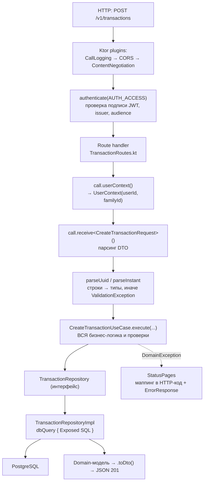
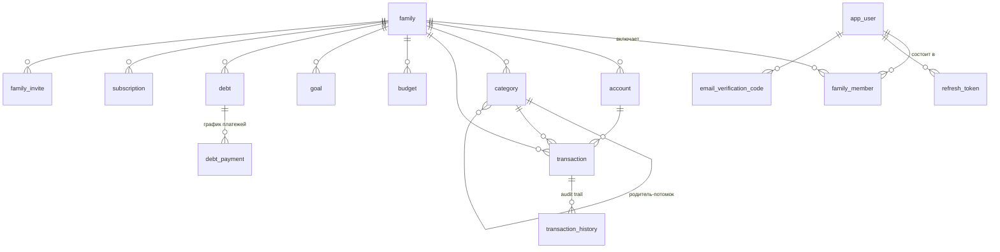
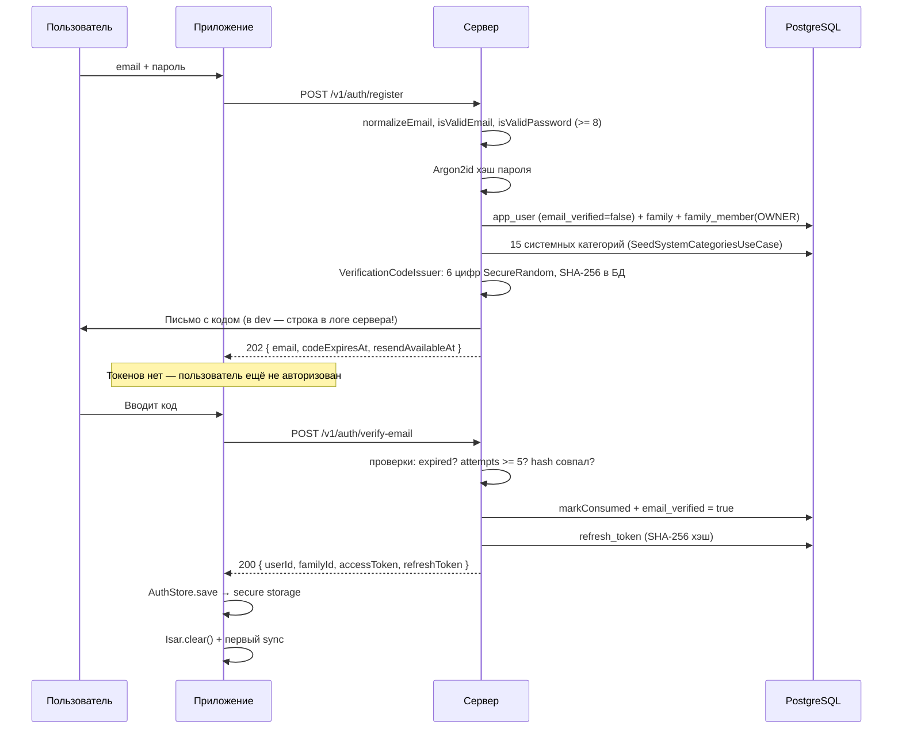
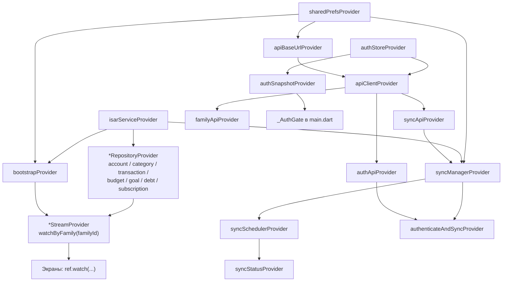
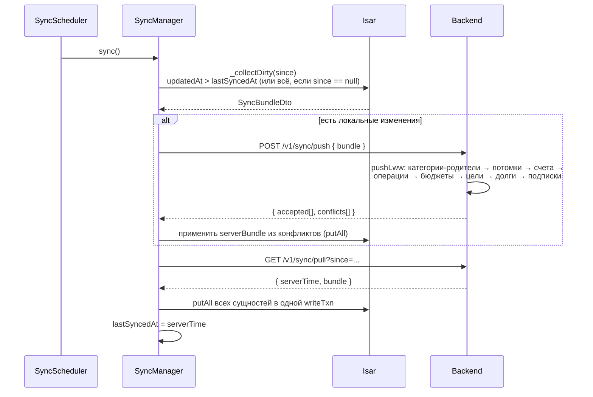

# MyMoney — полное руководство по кодовой базе

> **Для кого этот документ.** Для человека, который должен самостоятельно вносить изменения
> в проект: понимать, где что лежит, почему сделано именно так, и как добавить новую фичу,
> ничего не сломав.
>
> **Как читать.** Разделы 1–3 — обзорные, прочитайте подряд. Разделы 4–9 — справочник по слоям,
> открывайте по мере надобности. Раздел 10 — **рецепты «как сделать X»**, это самая практичная
> часть. Раздел 12 — грабли, на которые вы обязательно наступите.

**Оглавление**

| № | Раздел |
|---|--------|
| 1 | [Что это за проект за 60 секунд](#1-что-это-за-проект-за-60-секунд) |
| 2 | [Карта репозитория](#2-карта-репозитория) |
| 3 | [Пять инвариантов, которые нельзя нарушать](#3-пять-инвариантов-которые-нельзя-нарушать) |
| 4 | [Backend: устройство](#4-backend-устройство) |
| 5 | [База данных и миграции](#5-база-данных-и-миграции) |
| 6 | [Аутентификация: полный поток](#6-аутентификация-полный-поток) |
| 7 | [Mobile: устройство](#7-mobile-устройство) |
| 8 | [Синхронизация end-to-end](#8-синхронизация-end-to-end) |
| 9 | [Экраны и навигация](#9-экраны-и-навигация) |
| 10 | [Рецепты: как сделать X](#10-рецепты-как-сделать-x) |
| 11 | [Тесты и CI](#11-тесты-и-ci) |
| 12 | [Грабли и известные ограничения](#12-грабли-и-известные-ограничения) |
| 13 | [Шпаргалка команд](#13-шпаргалка-команд) |

---

## 1. Что это за проект за 60 секунд

**MyMoney** — приложение для учёта личных и семейных финансов. Две независимые части:

| | Backend | Mobile |
|---|---|---|
| **Язык** | Kotlin 2.1 (JVM 17) | Dart 3.5+ / Flutter 3.24+ |
| **Каркас** | Ktor 3.0.3 | Flutter |
| **БД** | PostgreSQL 16 | Isar 3.1 (встроенная NoSQL) |
| **Доступ к БД** | Exposed 0.57 + HikariCP | Isar API |
| **DI** | Koin 4 | Riverpod 2 (провайдеры) |
| **HTTP** | — (сервер) | Dio 5 |
| **Миграции** | Flyway | нет (Isar схема-less, миграции руками) |
| **Архитектура** | Clean Architecture | Clean Architecture |
| **Строк кода** | ~10 400 | ~26 000 |

**Главная идея — Offline First.** Мобильное приложение полностью работоспособно без сети.
Локальная Isar-БД — источник истины *на устройстве*. Сервер — источник истины *для семьи*.
Между ними — синхронизация push→pull с разрешением конфликтов по правилу
**LWW (last-write-wins) по `updated_at`**.

**Деньги — всегда целые копейки (`Long` / `int`).** Никаких `Double`, никаких `BigDecimal`
в моделях. `1 234,56 ₽` = `123456`. Это ADR-0002 и это не обсуждается — иначе поедут
округления в аналитике и бюджетах.

**Валюта на MVP — только RUB.** Поле `currency` есть в моделях и БД, но `CreateTransactionUseCase`
кидает `ValidationException`, если пришло не `"RUB"`. Это задел на будущее, не рабочая фича.

**Семья (`family`) — контейнер всех данных.** Не пользователь. Каждый счёт, категория, операция,
бюджет принадлежат `family_id`, а не `user_id`. Пользователь связан с семьёй через
`family_member`. При регистрации автоматически создаётся «семья из одного человека».
`family_id` вшит в JWT как claim — вся авторизация строится на нём.

---

## 2. Карта репозитория

```
MyMoney/
├── README.md                 Краткое описание, roadmap
├── HOWTO_RUN.md              Практическое руководство: как запустить и протестировать
├── DEPLOY.md                 Сборка APK, хостинг на Arch Linux, nginx, TLS, бэкапы
├── PROJECT_GUIDE.md          ← вы здесь
├── docker-compose.yml        Postgres (по умолчанию) + backend (профиль prod)
├── .env                      Секреты для docker-compose (не в git)
│
├── docs/
│   ├── MyMoney_Project_Bible_v2.md   Источник истины по продукту и архитектуре
│   ├── USE_CASES.md                  Пользовательские сценарии
│   └── adr/                          Architecture Decision Records (0001–0005)
│
├── backend/                  Ktor-сервер
│   ├── build.gradle.kts      Сборка, зависимости, конфиг Flyway и shadowJar
│   ├── gradle/libs.versions.toml   Version catalog — ВСЕ версии зависимостей здесь
│   ├── Dockerfile            Двухстадийная сборка: gradle:8.10-jdk17 → temurin:17-jre
│   └── src/
│       ├── main/kotlin/mymoney/
│       │   ├── Application.kt        Точка входа + проводка всех роутов
│       │   ├── config/AppConfig.kt   Чтение application.conf + проверки для prod
│       │   ├── di/AppModule.kt       Koin-модуль: ВСЕ зависимости регистрируются тут
│       │   ├── domain/               ← ЯДРО. Не знает про HTTP, SQL, Ktor
│       │   │   ├── model/            Чистые data-классы
│       │   │   ├── repository/       Интерфейсы репозиториев
│       │   │   ├── security/         Интерфейсы PasswordHasher, TokenService…
│       │   │   ├── usecase/          Бизнес-логика, по папке на домен
│       │   │   └── errors/           DomainException и наследники
│       │   ├── data/                 ← РЕАЛИЗАЦИИ
│       │   │   ├── db/               DatabaseFactory, dbQuery, Exposed-таблицы
│       │   │   ├── repository/       *RepositoryImpl — SQL живёт только здесь
│       │   │   ├── security/         Argon2, JWT, SHA-256
│       │   │   └── notification/     LoggingVerificationCodeSender
│       │   └── delivery/http/        ← HTTP
│       │       ├── routes/           Роуты по доменам
│       │       ├── dto/              @Serializable DTO + мапперы toDto/toDomain
│       │       ├── plugins/          CORS, ContentNegotiation, StatusPages
│       │       └── security/         JWT-плагин и call.userContext()
│       ├── main/resources/
│       │   ├── application.conf      HOCON-конфиг с ${?ENV_VAR} override'ами
│       │   ├── logback.xml
│       │   └── db/migration/         V1, V2, V3 — SQL-миграции Flyway
│       └── test/kotlin/mymoney/      Интеграционные тесты на Testcontainers
│
└── mobile/                   Flutter-клиент
    ├── pubspec.yaml          Зависимости
    ├── lib/
    │   ├── main.dart         runApp + _AuthGate + _Boot
    │   ├── core/
    │   │   ├── env.dart      API_BASE_URL по платформам, интервал синка
    │   │   └── providers/    app_providers.dart (локальные), api_providers.dart (сетевые)
    │   ├── domain/           ← ЯДРО. Чистый Dart, без Flutter и без Isar
    │   │   ├── model/        Account, Transaction, Money, balances.dart…
    │   │   ├── repository/   Интерфейсы
    │   │   └── usecase/      Бизнес-логика
    │   ├── data/
    │   │   ├── local/
    │   │   │   ├── isar_service.dart     Открытие Isar, компакция, purge
    │   │   │   ├── entities/             @collection + *_entity.g.dart (генерируются!)
    │   │   │   └── seed_data.dart        Системные категории (зеркало backend-каталога)
    │   │   ├── remote/
    │   │   │   ├── dio_client.dart       Bearer + авто-refresh на 401
    │   │   │   ├── auth_store.dart       Токены в flutter_secure_storage
    │   │   │   ├── api/                  auth_api, sync_api, family_api
    │   │   │   └── dto/sync_dto.dart     JSON ↔ domain для синка
    │   │   └── repository/               Local*Repository — работа с Isar
    │   ├── sync/
    │   │   ├── sync_manager.dart         Один цикл push→pull
    │   │   └── sync_scheduler.dart       Когда его запускать
    │   └── presentation/
    │       ├── screens/                  Экраны
    │       ├── screens/onboarding/       Welcome → регистрация → OTP → готово
    │       ├── providers/                Контроллеры экранов (Riverpod Notifier)
    │       ├── widgets/                  Переиспользуемые виджеты
    │       ├── theme/                    Цвета и темы
    │       └── services/pdf_export_service.dart
    ├── test/                 Unit + widget тесты
    ├── integration_test/     E2E прогон онбординга на устройстве
    └── screenshots/          Снимки, снятые integration-тестом
```

### Правило зависимостей (обе части)

```
presentation / delivery  →  domain  ←  data
                              ↑
                    domain НИ О КОМ не знает
```

`domain` не импортирует ни Ktor, ни Exposed, ни Flutter, ни Isar. Если вы пишете в `domain`
`import io.ktor…` или `import package:isar…` — вы делаете что-то не то.

---

## 3. Пять инвариантов, которые нельзя нарушать

Нарушение любого из них ломает данные, а не только компиляцию.

### 3.1. Деньги — целые копейки

```kotlin
val amountKopecks: Long   // 123456 == 1 234,56 ₽
```
```dart
final int amountKopecks;
```

Форматирование и парсинг — только через `Money` (`mobile/lib/domain/model/money.dart`):

```dart
Money.formatRub(123456)        // "1 234,56 ₽"
Money.parseToKopecks("1 234,56")  // 123456, или null если не распарсилось
```

### 3.2. `family_id` — обязательный фильтр всего

Любая выборка на бэкенде фильтруется по `familyId` из `UserContext`, который берётся
**только из проверенного JWT**:

```kotlin
val ctx = call.userContext()   // UserContext(userId, familyId)
```

Не из тела запроса, не из query-параметра. Иначе один пользователь прочитает данные другого.
Для проверки владения есть готовые хелперы: `getOwned`, `requireOwnedActive`,
`requireOwnedForTransaction` в `domain/usecase/*/`.

### 3.3. Soft delete, а не `DELETE`

Везде есть `is_deleted BOOLEAN`. Удаление — это `UPDATE … SET is_deleted = true, updated_at = now()`.
Причина: синхронизация. Если строку физически удалить, другое устройство никогда не узнает,
что её надо убрать — оно просто не увидит её в pull-е и оставит локальную копию навсегда.

Физическое удаление есть только на клиенте: `IsarService.purgeOldSoftDeleted()` вычищает
soft-deleted записи старше 30 дней при старте приложения — чтобы файл БД не рос вечно.

### 3.4. `updated_at` — валюта синхронизации

Каждое изменение записи обязано обновлять `updated_at` в UTC. На этом поле держится всё:

* клиент собирает «грязные» строки как `updatedAt > lastSyncedAt`;
* сервер решает конфликт как «у кого `updated_at` больше, тот и прав»;
* курсор синка — это серверное время последнего успешного pull.

Забыли обновить `updatedAt` в новом коде — изменение просто никогда не уедет на сервер.

### 3.5. ID генерирует клиент

Все сущности (счета, категории, операции, бюджеты…) создаются с UUID, сгенерированным
на клиенте, и передаются на сервер в теле запроса (`CreateTransactionRequest.id`).
Это позволяет создать операцию офлайн и потом отправить её как есть.

Исключение — **две вещи, которые генерирует сервер**: `user_id` и `family_id` при регистрации
(`RegisterUserUseCase`). См. ADR-0005.

---

## 4. Backend: устройство

### 4.1. Что происходит при старте

`backend/src/main/kotlin/mymoney/Application.kt`:

```kotlin
fun main(args: Array<String>) = EngineMain.main(args)          // Ktor читает application.conf
fun Application.module() = configureApplication(null)          // единственный module
```

`configureApplication` делает пять вещей по порядку:

1. **`loadAppConfig(environment.config)`** — читает HOCON. В production проверяет, что
   `JWT_SECRET` и `DB_PASSWORD` не остались дефолтными dev-значениями и что секрет ≥ 32 символов.
   Если нет — `require` бросает исключение и сервер не стартует. Это защита от «выкатили с dev-ключом».
2. **`DatabaseFactory(config.db).init()`** — поднимает HikariCP-пул, **прогоняет Flyway-миграции**,
   подключает Exposed. Миграции запускаются автоматически при каждом старте.
3. **`install(Koin) { modules(appModule(...)) }`** — регистрирует все зависимости.
4. **`configureHttp()` + `configureAuth(config.jwt)`** — плагины Ktor.
5. **`routing { … }`** — достаёт use case'ы из Koin через `by inject<…>()` и передаёт их
   в функции-роуты явными параметрами.

> **Важная деталь проводки.** Роуты получают use case'ы **аргументами**, а не через
> service locator внутри обработчика. Поэтому при добавлении нового use case надо
> тронуть три места: `AppModule.kt` (регистрация), `Application.kt` (inject + передача),
> файл роутов (параметр функции). Это многословно, но зато граф зависимостей виден целиком
> в одном файле.

### 4.2. Путь одного HTTP-запроса



### 4.3. Слои подробно

**`domain/model/`** — чистые `data class`. Никаких аннотаций сериализации, никаких ссылок
на БД. `Transaction`, `Account`, `Category`, `Budget`, `Goal`, `Debt`, `DebtPayment`,
`Subscription`, `Family`, `FamilyMember`, `User`, `UserContext`, `SyncBundle`.

**`domain/repository/`** — интерфейсы. Пример:

```kotlin
interface TransactionRepository {
    suspend fun create(tx: Transaction): Transaction
    suspend fun findById(id: UUID): Transaction?
    // …
}
```

**`domain/usecase/`** — по одному классу на операцию. Конструктор принимает интерфейсы
репозиториев и `Clock` со значением по умолчанию `Clock.System` — чтобы в тестах можно
было подсунуть фиксированное время. Единственный публичный метод — `execute(...)`.

Пример полной валидации из `CreateTransactionUseCase`:

```kotlin
if (currency != "RUB") throw ValidationException("MVP supports RUB only", …)
validateAmount(amountKopecks)                          // сумма > 0
validateTransferShape(type, accountId, targetAccountId, categoryId)
transactions.findById(id)?.let { throw ConflictException("TRANSACTION_ID_TAKEN", …) }
accounts.requireOwnedActive(ctx, accountId, "accountId")  // счёт наш, не удалён, не архивный
categories.requireOwnedForTransaction(ctx, categoryId, type)  // тип категории совпал с типом операции
```

Обратите внимание на «форму перевода» — это отдельный инвариант:

| Тип операции | `targetAccountId` | `categoryId` |
|---|---|---|
| `INCOME` | должен быть `null` | категория типа `INCOME` |
| `EXPENSE` | должен быть `null` | категория типа `EXPENSE` |
| `TRANSFER` | обязателен, ≠ `accountId` | должен быть `null` |

Это продублировано `CHECK`-констрейнтом в SQL (`V1__initial_schema.sql`) — то есть база
не примет некорректную строку, даже если логика где-то дала сбой.

**Суммы всегда положительные.** Направление денег определяет `type`, а не знак. Расход
на 500 ₽ — это `type = EXPENSE, amount = 50000`, а не `-50000`.

**`data/repository/`** — реализации. Весь SQL здесь и больше нигде. Каждый метод
оборачивается в `dbQuery`:

```kotlin
suspend fun <T> dbQuery(db: Database, block: suspend () -> T): T =
    newSuspendedTransaction(Dispatchers.IO, db) { block() }
```

Это транзакция Exposed на `Dispatchers.IO` — вызывающая корутина не блокируется.
Уровень изоляции пула — `TRANSACTION_REPEATABLE_READ`, autocommit выключен.

**`delivery/http/dto/`** — `@Serializable`-классы + функции-мапперы `Domain.toDto()` и
`Dto.toDomain()`. DTO отделены от домена намеренно: JSON-контракт может отличаться от
внутренней модели (например, в JSON поле называется `amount`, а в домене — `amountKopecks`).

**`delivery/http/routes/`** — тонкие. Обработчик обязан только: достать контекст, распарсить
тело, вызвать use case, отдать DTO. Ни одной бизнес-проверки в роутах быть не должно.

### 4.4. Обработка ошибок

Единственный механизм — `DomainException` (`domain/errors/DomainErrors.kt`), `sealed class`:

| Класс | HTTP | Дефолтный `code` |
|---|---|---|
| `NotFoundException` | 404 | `NOT_FOUND` |
| `ValidationException` | 400 | `VALIDATION_FAILED` (можно переопределить) |
| `ConflictException` | 409 | задаётся явно |
| `UnauthorizedException` | 401 | `UNAUTHORIZED` |
| `ForbiddenException` | 403 | `FORBIDDEN` (можно переопределить) |
| `TooManyRequestsException` | 429 | `TOO_MANY_REQUESTS` |

`StatusPages` в `HttpPlugins.kt` превращает их в единый формат ответа:

```json
{ "error": { "code": "INVALID_CODE", "message": "Invalid confirmation code",
             "details": { "attemptsLeft": "3" } } }
```

Всё остальное, что вылетело наружу, ловится как `Throwable` → 500 `INTERNAL_ERROR`,
а полный стектрейс уходит только в лог, не клиенту.

Поле `code` — это **машиночитаемый контракт с мобильным клиентом**. Клиент разбирает
именно его в `mobile/lib/presentation/providers/auth_error_messages.dart`. Меняете `code` —
чините клиент.

### 4.5. Полная карта эндпоинтов

Всё под префиксом `/v1`, кроме health-check. 🔓 — открытый, 🔒 — требует `Authorization: Bearer <accessToken>`.

| | Метод | Путь | Что делает |
|---|---|---|---|
| 🔓 | GET | `/healthz` | `{"status":"ok","db":"up"}`; 503 если БД недоступна |
| 🔓 | POST | `/v1/auth/register` | Создаёт аккаунт, шлёт код. **202, токенов НЕ даёт** |
| 🔓 | POST | `/v1/auth/verify-email` | Меняет код на сессию. **Здесь выдаются токены** |
| 🔓 | POST | `/v1/auth/resend-code` | Повторная отправка кода (не чаще раза в минуту) |
| 🔓 | POST | `/v1/auth/login` | Вход по email + паролю |
| 🔓 | POST | `/v1/auth/refresh` | Ротация refresh-токена |
| 🔒 | POST | `/v1/auth/logout-all` | Отзывает все refresh-токены пользователя |
| 🔒 | POST/GET | `/v1/accounts` | Создать / список (`?includeArchived=`) |
| 🔒 | GET/PUT/DELETE | `/v1/accounts/{id}` | Получить / обновить / soft-delete |
| 🔒 | POST | `/v1/accounts/{id}/archive` | Тело: `{ "archived": true }` или `false` |
| 🔒 | POST/GET | `/v1/categories` | Создать / список |
| 🔒 | GET/PUT/DELETE | `/v1/categories/{id}` | Получить / обновить / удалить |
| 🔒 | POST | `/v1/categories/{id}/archive` | Архивировать (системные — только так) |
| 🔒 | POST/GET | `/v1/transactions` | Создать / список (`accountId`, `categoryId`, `from`, `to`, `limit`, `offset`) |
| 🔒 | GET/PUT/DELETE | `/v1/transactions/{id}` | Получить / обновить / удалить |
| 🔒 | GET | `/v1/transactions/{id}/history` | Audit trail: снапшоты до изменений |
| 🔒 | POST/GET | `/v1/budgets` | Создать / список |
| 🔒 | GET/PUT/DELETE | `/v1/budgets/{id}` | Получить / обновить / удалить |
| 🔒 | GET | `/v1/budgets/{id}/progress` | План / факт / остаток / % / перерасход |
| 🔒 | POST/GET | `/v1/goals` | Создать / список |
| 🔒 | GET/PUT/DELETE | `/v1/goals/{id}` | Получить / обновить / удалить |
| 🔒 | POST | `/v1/goals/{id}/deposit` | Пополнить цель |
| 🔒 | POST | `/v1/goals/{id}/withdraw` | Снять с цели |
| 🔒 | POST/GET | `/v1/debts` | Создать / список |
| 🔒 | GET/PUT/DELETE | `/v1/debts/{id}` | Получить / обновить / удалить |
| 🔒 | POST/GET | `/v1/subscriptions` | Создать / список |
| 🔒 | GET/PUT/DELETE | `/v1/subscriptions/{id}` | Получить / обновить / удалить |
| 🔒 | POST | `/v1/subscriptions/{id}/advance` | Сдвинуть дату следующего списания |
| 🔒 | POST | `/v1/family/invite` | Создать инвайт-токен по email |
| 🔒 | POST | `/v1/family/accept` | Принять инвайт |
| 🔒 | GET | `/v1/family/members` | Список участников семьи |
| 🔒 | GET | `/v1/sync/pull` | `?since=<ISO-8601>` — что изменилось |
| 🔒 | POST | `/v1/sync/push` | Отправить пачку локальных изменений |

### 4.6. Конфигурация

`application.conf` (HOCON) — значение по умолчанию + `${?ENV_VAR}` override. Синтаксис такой:

```hocon
db {
    url = "jdbc:postgresql://localhost:5432/mymoney"
    url = ${?DB_URL}          # если переменная задана, перетирает строку выше
}
```

| Переменная | Дефолт | Комментарий |
|---|---|---|
| `PORT` | 8080 | |
| `APP_ENV` | `development` | `production` включает строгие проверки секретов |
| `DB_URL` / `DB_USER` / `DB_PASSWORD` | localhost / mymoney / mymoney_dev_password | |
| `DB_POOL_SIZE` | 10 | |
| `JWT_SECRET` | dev-заглушка | **в prod обязателен, ≥ 32 символов** |
| `JWT_ISSUER` / `JWT_AUDIENCE` | `mymoney` / `mymoney-mobile` | |
| `JWT_ACCESS_TTL_MINUTES` | 15 | |
| `JWT_REFRESH_TTL_DAYS` | 30 | |

Версии всех библиотек — **только** в `backend/gradle/libs.versions.toml`. В `build.gradle.kts`
пишется `implementation(libs.ktor.server.core)`, версии в нём нет.

> В `build.gradle.kts` есть два нетривиальных места с комментариями — не удаляйте их:
> `tasks.shadowJar { mergeServiceFiles() }` (иначе fat-jar теряет HOCON-загрузчик и падает
> с «Neither port nor sslPort specified») и пин Shadow 8.3.11 (совместимость с Gradle 9).

---

## 5. База данных и миграции

### 5.1. Схема



Общие поля почти всех таблиц: `id UUID PK`, `family_id UUID FK`, `created_at`, `updated_at`,
`is_deleted BOOLEAN`. Индексы — частичные, с `WHERE is_deleted = FALSE`, потому что запросы
почти всегда исключают удалённое.

### 5.2. Ключевые таблицы

* **`transaction`** — самая горячая. Индекс `(family_id, occurred_at DESC) WHERE NOT is_deleted`.
  `CHECK`-констрейнт на форму перевода (см. 4.3).
* **`transaction_history`** — audit trail. При каждом изменении операции туда пишется
  `snapshot_json JSONB` — состояние *до* правки. Хранится сырым JSON специально: транзакция
  версии v2 сможет восстановить снапшот v1 без миграции истории.
* **`category`** — двухуровневая иерархия через `parent_category_id`. Флаги: `is_system`
  (нельзя физически удалить, только архивировать), `is_mandatory` (обязательные траты).
* **`refresh_token`** — хранится SHA-256 хэш, не сам токен. Дамп базы не даёт подделать сессию.
* **`email_verification_code`** — так же хранится только хэш кода + счётчик попыток.
* **`account.credit_limit`** — `NULL` для обычных счетов, лимит в копейках для кредиток.

### 5.3. Миграции Flyway

| Файл | Что добавил |
|---|---|
| `V1__initial_schema.sql` | Вся базовая схема |
| `V2__credit_limit_debt_interest_and_schedule.sql` | `account.credit_limit`, `debt.interest_rate`, таблица `debt_payment` |
| `V3__email_verification.sql` | `app_user.email_verified`, таблица `email_verification_code` |

**Правила работы с миграциями:**

1. Уже применённую миграцию **никогда** не редактируют — Flyway хранит контрольную сумму
   и упадёт при следующем старте с `Migration checksum mismatch`.
2. Новая миграция — новый файл `V4__короткое_описание.sql` в `backend/src/main/resources/db/migration/`.
3. Применяются автоматически при старте сервера (`DatabaseFactory.init()`).
4. Новые колонки — `NULL`able или с `DEFAULT`, чтобы существующие строки не сломались.
   Смотрите, как это сделано в V2 (`ADD COLUMN IF NOT EXISTS … NOT NULL DEFAULT 0`).
5. Каждая миграция должна иметь пару в Exposed-таблице (`data/db/tables/*.kt`) —
   Exposed не читает схему из базы, он её описывает в коде. Забудете — получите
   ошибку «column does not exist» в рантайме.

---

## 6. Аутентификация: полный поток

### 6.1. Регистрация — два шага

Ключевая особенность: **`/register` не выдаёт токенов**. Аккаунт создаётся с
`email_verified = false` и остаётся непригодным, пока код из письма не подтверждён.



**Почему аккаунт создаётся до подтверждения.** Чтобы подтверждение было одним флипом флага,
а не отложенной транзакцией. Побочный эффект: повторная регистрация на неподтверждённый
адрес — не ошибка, а переотправка кода (`RegisterUserUseCase` явно это обрабатывает).
Логика в комментарии там же: человек скорее всего просто потерял первое письмо.

### 6.2. Защита кодов подтверждения

Всё сосредоточено в `VerificationCodeIssuer`:

| Параметр | Значение | Зачем |
|---|---|---|
| `CODE_TTL` | 10 минут | окно жизни кода |
| `MAX_ATTEMPTS` | 5 | после — код сжигается, нужен новый |
| `RESEND_COOLDOWN` | 1 минута | минимальный интервал между отправками |

Все три пути, которые могут отправить письмо (register, повторный register на
неподтверждённый адрес, resend-code), идут **через один класс** — иначе кулдаун можно было бы
обойти, выбрав другой эндпоинт, и `/register` превратился бы в бесплатный флудер чужих
почтовых ящиков.

При выдаче нового кода старый принудительно гасится (`consumeAllForUser`) — работает всегда
только последний код.

**`/resend-code` на незарегистрированный адрес отвечает обычным 202**, ничего не отправляя.
Это сделано специально: различимый ответ превратил бы открытый эндпоинт в оракул для
перебора зарегистрированных адресов.

### 6.3. Коды ошибок, на которые реагирует клиент

| `code` | Когда | Что делает приложение |
|---|---|---|
| `EMAIL_TAKEN` | 409 при регистрации | «Адрес уже зарегистрирован, войдите» |
| `EMAIL_NOT_VERIFIED` | 403 при логине | **Ведёт на экран подтверждения**, а не показывает ошибку |
| `INVALID_CODE` | 400, `details.attemptsLeft` | «Неверный код. Осталось попыток: N» |
| `CODE_EXPIRED` | 400 | «Срок истёк, запросите новый» |
| `TOO_MANY_ATTEMPTS` | 429 | «Слишком много попыток» |
| `RESEND_COOLDOWN` | 429, `details.retryAfterSeconds` | Запускает обратный отсчёт на кнопке |
| `EMAIL_ALREADY_VERIFIED` | 409 | «Почта уже подтверждена, войдите» |

Проверка `email_verified` в `LoginUseCase` стоит **после** проверки пароля — иначе можно было
бы выяснять, какие адреса зарегистрированы, не зная пароля.

### 6.4. Токены

| | Access | Refresh |
|---|---|---|
| Формат | JWT, HS256 | 256 бит из `SecureRandom`, base64url |
| Живёт | 15 минут | 30 дней |
| Хранится на сервере | нигде (stateless) | SHA-256 хэш в `refresh_token` |
| Claims | `sub` = userId, `family_id`, `iss`, `aud`, `jti`, `iat`, `exp` | — |

**Ротация.** `RefreshTokenUseCase` при каждом обновлении отзывает старый refresh
(`revoke`) и выдаёт новую пару. Токен одноразовый.

**Logout everywhere** — `revokeAllForUser`. Access-токены при этом продолжают работать
до истечения своих 15 минут (плата за stateless-проверку).

Пароли — **Argon2id**, параметры по OWASP 2024: 3 итерации, 64 MiB памяти, параллелизм 1.
Массив символов затирается (`wipeArray`) после хэширования.

### 6.5. Как это работает на клиенте

`mobile/lib/data/remote/dio_client.dart` — интерцептор Dio с двумя обязанностями:

1. **onRequest** — подставляет `Authorization: Bearer <access>` во всё, кроме auth-эндпоинтов
   (`login`, `register`, `verify-email`, `resend-code`, `refresh` — они открытые, Bearer там
   не нужен и вреден).
2. **onError** — на 401 один раз пробует refresh и повторяет исходный запрос.

Обновление сериализовано через `Completer<bool> _refreshLock`: если пять параллельных
запросов одновременно получили 401, refresh выполнится **один раз**, остальные дождутся его
результата. Без этого одноразовость refresh-токена ломается — четыре из пяти запросов
отправили бы уже отозванный токен.

Если refresh не удался — `authStore.clear()`, и приложение выкидывает на онбординг.

---

## 7. Mobile: устройство

### 7.1. Что происходит при запуске

`main.dart` — три уровня:

```
main()
 └─ ProviderScope
     └─ MyMoneyApp (MaterialApp, локаль ru, темы)
         └─ _AuthGate        ← смотрит authSnapshotProvider
             ├─ loading  → SplashScreen
             ├─ error    → WelcomeScreen (ошибку чтения хранилища трактуем как «сессии нет»)
             ├─ data == null → WelcomeScreen  (онбординг)
             └─ data != null → _Boot
                                └─ bootstrapProvider (сид/миграция)
                                    └─ HomeShell
```

**`_AuthGate` — это вся навигация верхнего уровня.** Здесь нет роутера: разлогин в любом
месте приложения инвалидирует `authSnapshotProvider`, гейт видит `null` и заменяет всё дерево
онбордингом. Подтверждение регистрации — наоборот, подставляет `HomeShell`. Никаких
`Navigator.pushAndRemoveUntil` не требуется.

> `go_router` есть в `pubspec.yaml`, но **в коде не используется**. Навигация внутри
> приложения — обычный `Navigator.push(MaterialPageRoute(...))` плюс `IndexedStack` в
> `HomeShell` для табов.

`bootstrapProvider` (`core/providers/app_providers.dart`):
* читает/создаёт `userId` и `familyId` в `SharedPreferences`;
* при первом запуске (`seeded != true`) засевает 15 системных категорий и счёт по умолчанию;
* запускает `purgeOldSoftDeleted()`;
* возвращает `LocalSession(userId, familyId)`, от которого зависят все стрим-провайдеры.

### 7.2. Граф провайдеров Riverpod

Это самая важная схема для понимания клиента. Всё построено на `FutureProvider`, потому что
и Isar, и SharedPreferences открываются асинхронно.



**Как данные попадают на экран.** Экран подписывается на стрим:

```dart
final txs = ref.watch(transactionsStreamProvider);
```

Под капотом это `Isar.watch(fireImmediately: true)`. Любая запись в Isar — откуда угодно:
пользователь добавил операцию, синхронизация притащила изменения с сервера — **немедленно
перерисовывает все подписанные экраны**. Никаких ручных «обнови список» не нужно.

**Важный нюанс `familyId`.** Стримы фильтруют по `session.familyId` из `bootstrapProvider`,
а он берётся из `SharedPreferences`, не из JWT напрямую. При логине
`AuthenticateAndSyncUseCase._resetLocal()` перезаписывает эти prefs и чистит Isar, поэтому
`SignInController` **обязан** после логина сделать `ref.invalidate(bootstrapProvider)` —
иначе закэшированная сессия продолжит указывать на прежнюю семью, и экраны будут пустыми.

### 7.3. Локальная БД (Isar)

`data/local/isar_service.dart` открывает один экземпляр на всё приложение:

```dart
Isar.open([AccountEntitySchema, CategoryEntitySchema, …],
  name: 'mymoney',
  inspector: kDebugMode,
  compactOnLaunch: CompactCondition(minFileSize: 1MB, minBytes: 512KB, minRatio: 1.3));
```

**Entity ≠ domain-модель.** В `data/local/entities/` лежат `@collection`-классы с
`Isar.autoIncrement`-идентификатором и явными мапперами:

```dart
Transaction toDomain() => …
static TransactionEntity fromDomain(Transaction t) => …
```

Наш бизнесовый `id` (UUID-строка) — это отдельное поле с `@Index(unique: true, replace: true)`.
`replace: true` означает «upsert по этому индексу» — на этом держится применение синка:
`putAll` просто перезаписывает строки с теми же UUID.

**Кодогенерация обязательна.** Файлы `*_entity.g.dart` создаются `build_runner`. После
любого изменения `@collection`-класса:

```bash
cd mobile
dart run build_runner build --delete-conflicting-outputs
```

Не сделаете — получите ошибки компиляции про отсутствующие `…Schema` или `…Entitys`.

**Enum'ы в Isar хранятся по имени** (`@enumerated`). В коде явно написано
`// Persisted by name — never renumber or rename`. Переименуете значение — все существующие
записи на устройствах пользователей станут нечитаемыми.

### 7.4. Репозитории

`data/repository/local_*_repository.dart` реализуют интерфейсы из `domain/repository/`.
Типовой набор методов: `create`, `findById`, `listByFamily`, `update`, `softDelete`,
`watchByFamily`. Пишут через `_isar.writeTxn(() async { … })`.

`softDelete` всегда выглядит так — обратите внимание на `updatedAt`, без него запись
не уедет на сервер:

```dart
e.isDeleted = true;
e.updatedAt = DateTime.now().toUtc();
await _isar.transactionEntitys.put(e);
```

### 7.5. Бизнес-логика на клиенте

Часть вычислений дублируется на клиенте, чтобы работать офлайн:

| Файл | Что считает |
|---|---|
| `domain/model/balances.dart` | Баланс каждого счёта: `initialBalance` + доходы − расходы, переводы двигают обе стороны |
| `domain/usecase/budget_progress.dart` | Прогресс бюджета и границы периода (WEEK = +7 дней, MONTH = +1 календарный месяц с обрезкой дня, YEAR = +1 год) |
| `domain/usecase/calculate_period_analytics.dart` | Доходы/расходы за период, разбивка по категориям с процентами, план/факт по бюджетам |
| `domain/model/money.dart` | Формат и парсинг рублей |

`budgetPeriodEnd` для MONTH аккуратно обрабатывает короткие месяцы: `start.day.clamp(1, lastDay)`,
чтобы 31 января не превратилось в 31 февраля.

**Переводы не участвуют в аналитике** — они не доход и не расход, деньги просто перекладываются.
Явный `break` в `switch` в `calculate_period_analytics.dart`.

---

## 8. Синхронизация end-to-end

### 8.1. Правила (ADR-0004, ADR-0005)

1. **Push всегда перед pull** в одном цикле — иначе pull перезатрёт свежие локальные изменения.
2. **LWW по `updated_at`** — у кого запись новее, тот побеждает.
3. **Конфликты из push применяются локально сразу** — эти строки на сервере уже новее,
   pull всё равно бы их вернул; применяем немедленно, чтобы UI не показывал устаревшее.
4. **Курсор** — `serverTime` последнего успешного pull, лежит в `SharedPreferences`
   под ключом `sync.last_synced_at`.

### 8.2. Один цикл



**Порядок в `pushLww` не случаен.** Категории вставляются родителями вперёд
(`partition { it.parentCategoryId == null }`), иначе внешний ключ `parent_category_id`
не разрешится. Счета — перед операциями по той же причине.

### 8.3. Когда запускается синхронизация

> ⚠️ **Сначала — главное.** На сегодня синхронизация реально запускается **ровно один раз**:
> при входе или подтверждении почты, из `AuthenticateAndSyncUseCase._acceptSession()`.
> `SyncScheduler` полностью написан, но **`start()` не вызывается ниоткуда**, и
> `syncSchedulerProvider` / `syncStatusProvider` не наблюдаются ни одним виджетом — а
> `FutureProvider` в Riverpod ленивый, поэтому планировщик даже не создаётся.
> Периодической и фоновой синхронизации в приложении сейчас нет. Как включить — см. §12.11.

Ниже — то, что планировщик **умеет**, когда его запустят. `sync/sync_scheduler.dart`
дёргает `SyncManager` в пяти случаях:

* при старте (`start()`);
* по таймеру каждые `SYNC_INTERVAL_SECONDS` (по умолчанию 60 с из `Env`);
* при возврате связи — подписка на `connectivity_plus`;
* при возврате приложения из фона (`AppLifecycleState.resumed`);
* вручную из UI (`triggerSync(reason: 'manual')`).

Защита от наложения: флаг `_syncInFlight` — параллельные циклы не запускаются.
Ретраи — 3 попытки с экспоненциальной задержкой 300 / 600 / 1200 мс.

**Планировщик никогда не бросает исключений наружу.** Ошибки складываются в `SyncStatus`
(`idle` / `syncing` / `offline` / `error`) и уходят в лог. UI подписывается на
`syncStatusProvider` и показывает состояние.

### 8.4. Сброс локальных данных при входе

`AuthenticateAndSyncUseCase._acceptSession()` делает жёсткую вещь — `isar.clear()`.

Причина: в офлайн-режиме до авторизации клиент генерирует **случайный** `familyId` и засевает
категории с ним. После входа авторитетным становится `familyId` с сервера, и локальные строки
с прежним ключом стали бы мусором с чужим внешним ключом. Поэтому локальная база стирается
и заполняется заново через pull.

Там же сбрасывается курсор (`prefs.remove('sync.last_synced_at')`), чтобы первый pull пришёл
полным снапшотом, а `seeded` ставится в `true` — категории придут с сервера, локальный сид не нужен.

---

## 9. Экраны и навигация

### 9.1. Онбординг

| Экран | Файл | Роль |
|---|---|---|
| Splash | `onboarding/splash_screen.dart` | Пока читается secure storage |
| Welcome | `onboarding/welcome_screen.dart` | Карусель + «Создать аккаунт» / «Войти» |
| Создайте аккаунт | `onboarding/create_account_screen.dart` | Email + пароль, индикатор силы пароля |
| Подтвердите почту | `onboarding/email_verification_screen.dart` | OTP-поле, кулдаун переотправки |
| Аккаунт создан | `onboarding/account_created_screen.dart` | **Здесь публикуется сессия** |
| Вход | `onboarding/sign_in_screen.dart` | Логин |

**Тонкость с `AccountCreatedScreen`.** `EmailVerificationController` кладёт полученную сессию
в своё состояние (`state.session`), а **не** сразу в `authSnapshotProvider`. Публикация
переключила бы `_AuthGate` мгновенно и снесла бы весь flow до того, как пользователь увидит
экран «Аккаунт успешно создан». Поэтому сессию публикует финальный экран. Это прокомментировано
в коде — не «оптимизируйте».

### 9.2. Основной скелет

`HomeShell` — `IndexedStack` из четырёх табов плюс кастомная нижняя навигация по макету Figma
(таблетка с четырьмя вкладками + отдельная круглая кнопка «+»):

| Таб | Экран |
|---|---|
| Главная | `home_tab.dart` — общий баланс, круговая диаграмма по категориям, счета, последние операции |
| Операции | `transactions_screen.dart` |
| Бюджет | `budgets_screen.dart` |
| Настройки | `settings_screen.dart` |

Кнопка «+» открывает `AddTransactionScreen` через `Navigator.push`.

`IndexedStack` держит все четыре таба живыми одновременно — состояние вкладок (скролл, фильтры)
не теряется при переключении.

### 9.3. Что за «Настройками»

`SettingsScreen` — хаб, из которого открывается **всё остальное**. Пункты сгруппированы,
поиск сверху фильтрует их по названию и подписи:

| Группа | Пункты |
|---|---|
| Разделы | Статистика (`analytics_screen.dart`), Цели (`goals_screen.dart`), Долги (`debts_screen.dart`), Подписки (`subscriptions_screen.dart`) |
| Справочники | Счета (`accounts_screen.dart`), Категории (`categories_screen.dart`) |
| Данные | Экспорт отчёта, Синхронизация (`sync_screen.dart`), Семья (`family_screen.dart`), Подключение к серверу (`server_settings_screen.dart`) |
| Оформление | Тема — заглушка (`showUnderDevelopment`) |
| О приложении | Версия, Условия, Политика |

Плюс карточка профиля (`profile_screen.dart`) сверху и «Выйти» внизу
(`authStore.clear()` + `ref.invalidate(authSnapshotProvider)`).

Пункты, закрытые `FeatureFlags` (экспорт, синхронизация, семья), **остаются видимыми**
с пометкой «Скоро» и по тапу показывают `showUnderDevelopment` — пользователь видит, что
функция существует, а не что её нет. Один `true` во флаге превращает пункт в рабочий,
править `settings_screen.dart` при этом не нужно.

### 9.4. Дизайн-система: `theme/app_ui.dart`

Стиль главного экрана вынесен в один файл, и все экраны собираются из него:

* **`MmColors` / `MmType` / `MmShadows`** — бежевый фон `#F4EDE3`, белые карточки
  (радиус 34 крупные, 24 плитки, 14 группы строк), типографика SF Pro, палитра диаграмм;
* **`MmScreen`** — каркас: фон, `SafeArea`, крупный заголовок, кнопка «назад» или действия
  справа, необязательная строка фильтров. Флаг `embedded: true` — для табов внутри
  `HomeShell`: собственный `Scaffold` там перекрыл бы нижнюю навигацию;
* **блоки** — `MmCard`, `MmGroupCard` + `MmMenuRow`, `MmSectionHeader`, `MmSegmented`,
  `MmListRow`, `MmProgressBar`, `MmEmptyState`, `MmChip`;
* **формы** — `mmShowSheet` + `MmSheet` (отступ под клавиатуру уже внутри), `MmField`,
  `MmPickerRow`, `MmSwitchRow`, `MmChipsField`;
* **диалоги и сообщения** — `mmConfirm`, `mmSnack`, `mmPush`.

Правило: новый экран не объявляет своих цветов и `TextStyle`. Если нужного блока нет —
он добавляется в `app_ui.dart`, а не копируется в экран.

Дымовые тесты `test/presentation/screens_smoke_test.dart` рендерят каждый экран с данными
и на пустой базе — ловят переполнения и непереопределённые провайдеры, которых
`flutter analyze` не видит.

### 9.5. Паттерн «экран + контроллер»

Экраны со сложным состоянием (все онбординговые) разделены надвое:

* **State-класс** — иммутабельный, с `copyWith` и вычисляемыми геттерами
  (`canSubmit`, `isEmailValid`, `passwordStrength`);
* **Notifier-контроллер** — методы `emailChanged`, `submit`, `resendCode`;
* **Widget** — только `ref.watch(...)` и вызовы методов контроллера.

Используется `AutoDisposeNotifier` — состояние умирает вместе с экраном. Для
`EmailVerificationController` это критично: он держит `Timer` обратного отсчёта, который
без `autoDispose` тикал бы до конца сессии.

Клиентская валидация зеркалит серверную: `RegistrationState.canSubmit` не пускает пароль
слабее 8 символов, потому что сервер такой запрос всё равно отклонит.

---

## 10. Рецепты: как сделать X

### 10.1. Добавить поле в существующую сущность

Пример: добавить `note` к счёту. Полный обход — **девять** мест.

**Backend:**
1. `src/main/resources/db/migration/V4__account_note.sql`:
   ```sql
   ALTER TABLE account ADD COLUMN IF NOT EXISTS note TEXT;
   ```
2. `data/db/tables/AccountTable.kt` — добавить колонку в Exposed-описание.
3. `domain/model/Account.kt` — поле в data-классе.
4. `data/repository/AccountRepositoryImpl.kt` — в маппер `ResultRow → Account` и в insert/update.
5. `delivery/http/dto/AccountDto.kt` — в DTO и мапперы.
6. `domain/usecase/account/CreateAccountUseCase.kt` и `UpdateAccountUseCase.kt` — параметр.
7. `delivery/http/routes/AccountRoutes.kt` — прокинуть из тела запроса.
8. `data/repository/SyncRepositoryImpl.kt` — в `pullChanged` и `upsertAccount`, иначе поле
   не будет синхронизироваться.

**Mobile:**
9. `domain/model/account.dart` (+ `copyWith`), `data/local/entities/account_entity.dart`
   (+ мапперы), `data/remote/dto/sync_dto.dart` (JSON), затем
   `dart run build_runner build --delete-conflicting-outputs`, и наконец UI.

> Забыть шаг 8 или его клиентскую половину — самая частая ошибка: локально всё работает,
> а между устройствами поле не ездит.

### 10.2. Добавить новый эндпоинт

1. **Use case** в `domain/usecase/<домен>/`. Конструктор — интерфейсы репозиториев,
   один метод `execute(ctx: UserContext, …)`. Первым делом — проверка владения через
   `getOwned` / `requireOwnedActive`.
2. **DTO** в `delivery/http/dto/` + мапперы.
3. **Роут** в `delivery/http/routes/<Домен>Routes.kt` — добавить параметр в сигнатуру
   `fun Route.xxxRoutes(...)` и обработчик внутри `authenticate(AUTH_ACCESS)`.
4. **Koin**: `single { NewUseCase(get()) }` в `di/AppModule.kt`.
5. **Проводка**: `val newUseCase by inject<NewUseCase>()` в `Application.kt` и передать
   в вызов роутов.
6. **Тест** в `src/test/kotlin/mymoney/delivery/http/routes/`.

### 10.3. Добавить новую сущность целиком

Порядок, в котором ломается меньше всего:

```
1. SQL-миграция V{N}__*.sql
2. backend: data/db/tables/XTable.kt         (Exposed)
3. backend: domain/model/X.kt
4. backend: domain/repository/XRepository.kt (интерфейс)
5. backend: data/repository/XRepositoryImpl.kt
6. backend: domain/usecase/x/*.kt            (Create/List/Get/Update/Delete)
7. backend: delivery/http/dto/XDto.kt
8. backend: delivery/http/routes/XRoutes.kt
9. backend: di/AppModule.kt + Application.kt
10. backend: SyncRepositoryImpl + SyncBundle + SyncDto  ← если сущность синхронизируется
11. mobile: domain/model/x.dart
12. mobile: data/local/entities/x_entity.dart → build_runner
13. mobile: IsarService.open([... XEntitySchema])        ← легко забыть!
14. mobile: domain/repository/x_repository.dart + data/repository/local_x_repository.dart
15. mobile: провайдеры в core/providers/app_providers.dart (repo + stream)
16. mobile: sync_manager._collectDirty + _applyBundle + sync_dto.dart
17. mobile: экран
```

### 10.4. Изменить адрес backend'а

`apiBaseUrlProvider` разрешает адрес по такому приоритету:

1. **`SharedPreferences`, ключ `api.base_url`** — пишется из приложения:
   **Настройки → Данные → Подключение к серверу** (`server_settings_screen.dart`).
   Экран вызывает `setApiBaseUrl(prefs, url)` / `clearApiBaseUrl(prefs)` и сбрасывает
   `apiBaseUrlProvider` — все сетевые провайдеры (`ApiClient`, `AuthApi`, `SyncApi`)
   построены поверх него и пересобираются сами.
2. **При сборке**: `flutter run --dart-define=API_BASE_URL=http://192.168.1.50:8080`
3. **Дефолт по платформе** (`core/env.dart`): Android-эмулятор → `10.0.2.2:8080`,
   всё остальное (iOS-симулятор, десктоп, web) → `localhost:8080`.

> На **реальном телефоне** ни один дефолт не подходит — нужен LAN-адрес компьютера.
> Его вводят либо на экране «Подключение к серверу», либо `--dart-define` при сборке.
> Экран лежит за гейтом авторизации, поэтому для самого первого входа на устройстве
> удобнее `--dart-define`.

### 10.5. Получить код подтверждения в разработке

Реальная почта **не отправляется**. `LoggingVerificationCodeSender` пишет в лог сервера:

```
[DEV] Email confirmation code for me@example.com is 123456 (valid until ...)
```

Чтобы включить настоящую отправку — заменить биндинг в `di/AppModule.kt`:

```kotlin
single<VerificationCodeSender> { verificationCodeSender ?: LoggingVerificationCodeSender() }
//                                                          ^^^ сюда SMTP-реализацию
```

### 10.6. Добавить системную категорию

Каталог продублирован в двух местах, и их нужно править **синхронно**:

* `backend/.../domain/usecase/category/SystemCategoriesCatalog.kt`
* `mobile/lib/data/local/seed_data.dart`

В mobile-файле есть прямое напоминание: *«Keep the two in sync when adding rows»*.
Иконки — имена Material Symbols; рендерит их `presentation/widgets/category_icon.dart`.

### 10.7. Обновить зависимость на бэкенде

Только через version catalog:

```toml
# backend/gradle/libs.versions.toml
[versions]
ktor = "3.0.3"     # ← меняете здесь
```

В `build.gradle.kts` версий нет — там `libs.ktor.server.core`.

---

## 11. Тесты и CI

### 11.1. Backend

```bash
cd backend
./gradlew test
```

Интеграционные тесты поднимают **настоящий Postgres** через Testcontainers
(`test/kotlin/mymoney/test/TestPostgres.kt`) — то есть нужен работающий Docker.

Если Docker недоступен (классический случай — Docker Desktop на Windows, где Testcontainers
не находит нужный pipe), можно указать внешнюю базу:

```bash
TEST_DB_URL=jdbc:postgresql://localhost:5432/mymoney_test \
TEST_DB_USER=postgres TEST_DB_PASSWORD=postgres ./gradlew test
```

Тесты **не чистят базу** между прогонами — они изолируются уникальными email и UUID.
Соблюдайте этот контракт в новых тестах.

Для тестов регистрации есть `CapturingVerificationCodeSender` — перехватывает коды вместо
отправки, что позволяет пройти двухшаговую регистрацию в тесте. Готовый хелпер:

```kotlin
val session = registerAndVerify("user-${UUID.randomUUID()}@test.com")
```

Именно ради этого `configureApplication` принимает `verificationCodeSender: VerificationCodeSender?`.

Покрыто: `AuthRoutes`, `AccountRoutes`, `CategoryRoutes`, `TransactionRoutes`, `BudgetRoutes`,
`GoalRoutes`, `FamilyRoutes`, `SyncRoutes`, `HealthRoutes`, `Argon2PasswordHasher`, `JwtTokenService`.

### 11.2. Mobile

```bash
cd mobile
flutter test              # unit + widget
flutter analyze lib       # линт (как в CI — только lib/)
```

Unit-тесты покрывают чистую логику: `budget_progress_test.dart`,
`calculate_period_analytics_test.dart`, `password_strength_test.dart`.

**Integration-тест** (`integration_test/onboarding_flow_test.dart`) прогоняет реальное
приложение на устройстве и снимает скриншоты в `mobile/screenshots/`:

```bash
flutter drive --driver=test_driver/integration_test.dart \
              --target=integration_test/onboarding_flow_test.dart -d <device-id>
```

Тест доходит до экрана OTP и останавливается — угадать 6-значный код он не может,
серверный happy path проверяется в `AuthRoutesIntegrationTest`.

### 11.3. CI

`.github/workflows/ci.yml` — на push и PR в `Alpha` и `main`, две независимые джобы:

* **backend**: JDK 17 → кэш Gradle → `./gradlew test` → выгрузка отчётов;
* **mobile**: Flutter 3.24 → `pub get` → `flutter analyze lib` → `flutter test`.

`.github/workflows/release-apk.yml` — сборка релизного APK на push в `Alpha` и на теги `v*`.

---

## 12. Грабли и известные ограничения

Это не список багов — это то, что **устроено именно так**, и об этом надо знать.

### 12.1. Почта не отправляется — вообще

`LoggingVerificationCodeSender` — единственная реализация `VerificationCodeSender`, и
`AppModule` откатывается на неё **в том числе в production**. То есть боевой деплой сейчас
пишет коды подтверждения в лог приложения и не отправляет ни одного письма. Это честно
задокументировано в комментарии к классу. Точка расширения — биндинг в `AppModule.kt`.

### 12.2. `debtPayments` не синхронизируются с клиента

`SyncBundleDto` на клиенте умеет сериализовать `debtPayments`, и сервер их принимает,
но `SyncManager._collectDirty()` их **не собирает** — там нет запроса к `debtPaymentEntitys`.
График платежей по долгу останется локальным. Если понадобится — добавьте сбор по аналогии
с остальными коллекциями.

### 12.3. `go_router` в зависимостях, но не используется

Пакет объявлен в `pubspec.yaml`, в `lib/` не встречается ни одного импорта. Навигация —
`Navigator` + `IndexedStack` + реактивный `_AuthGate`. Либо выпилите зависимость, либо
осознанно переезжайте на роутер — но не пишите половину экранов на одном, половину на другом.

### 12.4. `_periodOverlaps` в аналитике упрощён

В `calculate_period_analytics.dart`:

```dart
// Simplified: if budget starts before analytics period ends, consider it overlapping
return budgetStart.isBefore(analyticsPeriodEnd);
```

Точное пересечение периодов не считается — старые бюджеты попадут в сравнение,
если начались до конца анализируемого периода. Комментарий в коде это признаёт.

### 12.5. `firstWhere ... orElse: throw StateError`

Там же: если у транзакции есть `categoryId`, но самой категории в списке нет (например,
её физически удалили при purge, а операция осталась), расчёт аналитики **упадёт**
`StateError`. Рабочее место для защитного кода, если начнёте ловить такие падения.

### 12.6. Access-токен переживает logout-all

`logout-all` отзывает refresh-токены, но выданные access-токены остаются валидными
до 15 минут. Это осознанная плата за stateless-проверку JWT.

### 12.7. CORS открыт всем

`install(CORS) { anyHost() }` в `HttpPlugins.kt`, с комментарием «Restrict in production».
Перед боем ограничьте.

### 12.8. Изоляция транзакций и LWW

Пул настроен на `TRANSACTION_REPEATABLE_READ`, `pushLww` идёт одной транзакцией.
Но само правило LWW теряет данные по определению: одновременная правка одной записи на двух
устройствах — победит та, у которой `updated_at` больше, вторая пропадёт. Смягчение для
операций — `transaction_history`: перезаписанное состояние сохраняется снапшотом и его можно
восстановить. Для остальных сущностей истории нет.

### 12.9. Часовые пояса

Всё хранится и сравнивается в **UTC** (`DateTime.now().toUtc()`, `TIMESTAMPTZ`).
Единственное место, где сознательно берётся локальное время, — вычисление начала недели
в `analytics_providers.dart`: иначе в UTC+3 «понедельник» уезжал бы на другой день.
Не копируйте `DateTime.now()` без `.toUtc()` в новый код.

### 12.10. Адрес сервера меняется только после входа

Поле для адреса есть — «Настройки → Подключение к серверу», — но `SettingsScreen` живёт
за гейтом авторизации. Пока сессии нет, добраться до него нельзя, поэтому самый первый
вход на реальном устройстве по-прежнему требует `--dart-define=API_BASE_URL=…`
при сборке. Подробнее — §10.4.

### 12.11. Планировщик синхронизации не подключён

`SyncScheduler` реализован полностью (таймер, connectivity, lifecycle, ретраи, статусы),
но его `start()` не вызывается, а `syncSchedulerProvider` никто не watch'ит — значит,
ленивый `FutureProvider` даже не инстанцируется. Фактически данные уезжают на сервер
и приезжают обратно **только в момент логина**.

Чтобы включить, достаточно наблюдать провайдер и запустить планировщик там, где приложение
уже авторизовано, — например, в `_Boot` или `HomeShell`:

```dart
// внутри ConsumerStatefulWidget-а, живущего всё время сессии
@override
void initState() {
  super.initState();
  Future.microtask(() async {
    final scheduler = await ref.read(syncSchedulerProvider.future);
    await scheduler.start();
  });
}
```

Индикатор и ручной запуск уже написаны — экран `sync_screen.dart` («Настройки → Данные →
Синхронизация»): он читает `syncStatusProvider` (`idle / syncing / offline / error`,
счётчики отправленного/полученного) и дёргает `scheduler.triggerSync()`. Пункт меню
открывает его только при `FeatureFlags.cloudSync == true`; пока флаг выключен, тап
показывает «в разработке». Планировщик всё равно нужно запустить — кодом выше.

### 12.12. Заглушки в меню

Пункт «Тема» — заглушка (`showUnderDevelopment`): тема всегда светлая.
«Валюта» убрана намеренно (ADR-0002 + ADR-0006, только рубль).
На экране профиля прочерками показаны поля, которых пока нет на сервере:
почта, смена пароля, список устройств, биометрия.

---

## 13. Шпаргалка команд

### Первый запуск с нуля

```bash
# 1. Postgres
docker compose up -d postgres
docker compose ps                     # healthy?

# 2. Backend
cd backend
./gradlew run                         # миграции применятся сами
curl http://localhost:8080/healthz    # {"status":"ok","db":"up"}

# 3. Mobile
cd ../mobile
flutter pub get
dart run build_runner build --delete-conflicting-outputs
flutter run
```

### Регистрация через curl (для проверки бэкенда)

```bash
# Шаг 1 — 202, токенов нет
curl -X POST http://localhost:8080/v1/auth/register \
  -H 'Content-Type: application/json' \
  -d '{"email":"me@example.com","password":"password123"}'

# Шаг 2 — код взять из лога сервера ([DEV] Email confirmation code ...)
curl -X POST http://localhost:8080/v1/auth/verify-email \
  -H 'Content-Type: application/json' \
  -d '{"email":"me@example.com","code":"123456"}'
# → accessToken, refreshToken, userId, familyId

# Шаг 3 — защищённый вызов
curl http://localhost:8080/v1/categories -H "Authorization: Bearer <accessToken>"
```

### Повседневное

| Задача | Команда |
|---|---|
| Тесты бэкенда | `cd backend && ./gradlew test` |
| Сборка fat-jar | `cd backend && ./gradlew buildFatJar` → `build/libs/mymoney-backend.jar` |
| Состояние миграций | `cd backend && ./gradlew flywayInfo` |
| Перегенерировать Isar | `cd mobile && dart run build_runner build --delete-conflicting-outputs` |
| Тесты клиента | `cd mobile && flutter test` |
| Линт как в CI | `cd mobile && flutter analyze lib` |
| Release APK | `cd mobile && flutter build apk --release` |
| Прод-подобный стек | `docker compose --profile prod up -d` (нужен `JWT_SECRET` в `.env`) |
| Логи backend-контейнера | `docker compose logs -f backend` |

### Куда смотреть в первую очередь

| Вопрос | Файл |
|---|---|
| Что вообще происходит при старте сервера | `backend/.../Application.kt` |
| Где зарегистрированы зависимости | `backend/.../di/AppModule.kt` |
| Какие есть эндпоинты | `backend/.../delivery/http/routes/` |
| Как устроена схема БД | `backend/src/main/resources/db/migration/V1__initial_schema.sql` |
| Что происходит при старте приложения | `mobile/lib/main.dart` |
| Откуда экраны берут данные | `mobile/lib/core/providers/app_providers.dart` |
| Как работает синхронизация | `mobile/lib/sync/sync_manager.dart` |
| Как запустить и протестировать руками | `HOWTO_RUN.md` |
| Как задеплоить | `DEPLOY.md` |
| Почему принято то или иное решение | `docs/adr/` и `docs/MyMoney_Project_Bible_v2.md` |

---

## Приложение: ADR — краткое содержание

| ADR | Решение |
|---|---|
| **0001** | Стек: Kotlin + Ktor + Postgres на сервере, Flutter + Riverpod + Isar на клиенте. KMP отвергнут. |
| **0002** | Деньги — целые копейки (`BIGINT` / `Int64`). Никаких плавающих типов. |
| **0003** | SQL-слой — Exposed (не JOOQ, не Hibernate). |
| **0004** | Разрешение конфликтов — LWW по `updated_at` + audit trail для операций. |
| **0005** | Контракт синхронизации: push→pull, ID генерирует клиент (кроме user/family), ротация refresh-токенов. |

Полные тексты — `docs/adr/`. Продуктовые решения и открытые вопросы — `docs/MyMoney_Project_Bible_v2.md`.
